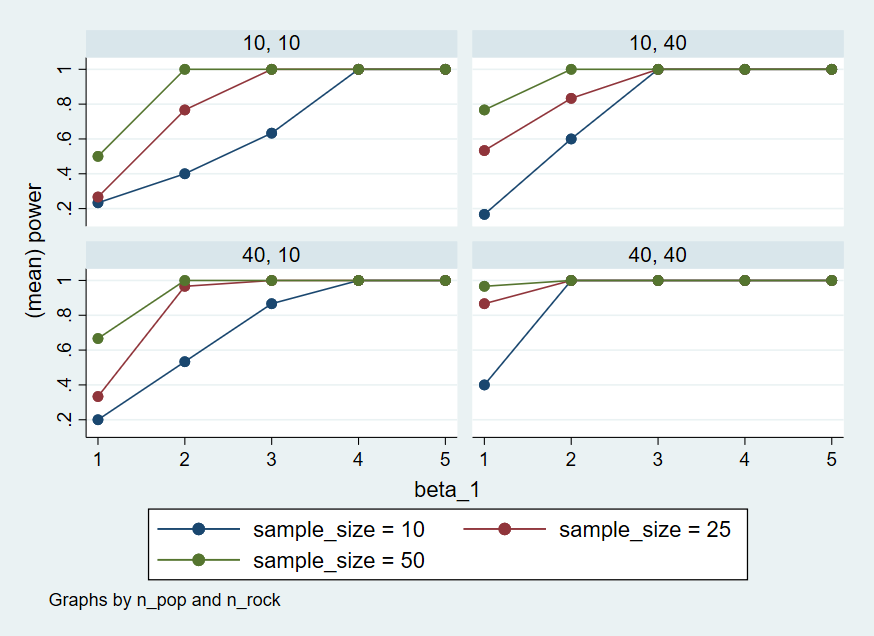

```{r setup, include=FALSE}
require(knitr)

# https://users.ssc.wisc.edu/~hemken/Stataworkshops/Statamarkdown/stata-and-r-markdown.html
library(Statamarkdown)
knitr::opts_chunk$set(engine.path=list(stata="C:/Program Files/Stata17/StataMP-64.exe"))
```

# Stata

## Setup

We will need several Stata packages to draw a violin plot. We can use "ssc install [package_name]" to install them.

```{stata}
// ssc install violinplot, replace     // module to draw violin plots
// ssc install dstat, replace          // violinplot's dependency, module to compute summary statistics
// ssc install moremata, replace       // violinplot's dependency, module (Mata) to provide various functions
// ssc install palettes, replace       // violinplot's dependency, module to provide color palettes
// ssc install colrspace, replace      // violinplot's dependency, module providing a class-based color management system in Mata
```

We will also set the pseudo-random number generator seed to `02138` to make the stochastic components of our simulations reproducible (this is similar to the process in R and Python).

```{stata, collectcode=TRUE}
clear all
set seed 02138
```

## Data simulation step by step

To give an overview of the power simulation task, we will simulate data from a design with crossed random factors of subjects and songs (see [Power of What?](./power-of-what.html) for design details), fit a model to the simulated data, recover from the model output the parameter values we put in, calculate power, and finally automate the whole process so that we can calculate power for different effect sizes. \### Establish the simulation parameters

Before we start, let's set some global parameters for our power simulations.

```{stata, collectcode=TRUE}
// number of simulation replications for power calculation
global reps = 30

// specified alpha for power calculation
global alpha = 0.05
```

### Establish the data-generating parameters

The first thing to do is to set up the parameters that govern the process we assume gave rise to the data - the *data-generating process*, or DGP. We previously decided upon the the data-generating parameters (see [Power of What?](./power-of-what.html)), so we just need to code them here.

Note: There is a difference between Stata and R and the Python: We decrease the data-generating parameters to simplify our model, and we delete some parameters: by-song random intercept `omega_0`, by-subject random slope sd `tau_1`, and the correlation between intercept and slope `rho`.

```{stata, collectcode=TRUE}
// set all data-generating parameters
global beta_0 = 60   // intercept; i.e., the grand mean
global beta_1 = 5    // slope; i.e., effect of category
global tau_0 = 7     // by-subject random intercept sd
global sigma = 8     // residual (error) sd
```

### Simulate the sampling process

Next, we will simulate the sampling process for the data. First, let's define parameters related to the number of observations.

```{stata, collectcode=TRUE}
// Set number of subjects and songs
global n_subj = 25   // number of subjects
global n_pop = 15    // number of songs in pop category
global n_rock = 15   // number of songs in rock category
global n_all = $n_pop + $n_rock
```

#### Simulate the sampling of songs

We need to create a table listing each song $i$, which category it is in (`rock` or `pop`).

```{stata}
// simulate a sample of songs
quietly {
  clear
  set obs $n_all

  // Generate a sequence of song ids
  gen song_id = _n

  // Generate the category variable
  gen category = "pop"
  replace category = "rock" if song_id > $n_pop

  // Generate the genre variable
  gen genre_i = 0
  replace genre_i = 1 if song_id > $n_pop

  gen key = 1

  save "./data/songs.dta", replace
}
list in 1/10
```

#### Simulate the sampling of subjects

Now we simulate the sampling of participants, which results in table listing each individual and their random effect (a random intercept). To do this, we must sample $t_0$ from a normal distribution.

We will use the function `rnormal`, which generates a simulated value from a univariate normal distribution with a mean of 0 and a standard deviations of `tau_0` of each variable.

```{stata}
// simulate a sample of subjects
quietly {
  clear
  set obs $n_subj

  // Generate the by-subject random intercept
  gen t0 = rnormal(0, $tau_0)

  // Generate a sequence of subject ids
  gen subj_id = _n

  gen key = 1

  save "./data/subjects.dta", replace
}
list in 1 / 10
```

#### Check the simulated values

Let's do a quick sanity check by comparing our simulated values to the parameters we used as inputs. Because the sampling process is stochastic, we shouldn't expect that these will exactly match for any given run of the simulation.

```{stata}
quietly {
  use "./data/subjects.dta"

  qui summarize t0
  egen tau_0_s = sd(t0)
}
display "tau_0, " $tau_0 ", " tau_0_s
```

#### Simulate trials

Since all subjects rate all songs (i.e., the design is fully crossed) we can set up a table of trials by including every possible combination of the rows in the `subjects` and `songs` tables. Each trial has random error associated with it, reflecting fluctuations in trial-by-trial ratings due to unknown factors. We simulate this by sampling values from a univariate normal distribution with a mean of 0 and a standard deviation of `sigma`.

```{stata}
// cross subject and song IDs; add an error term
quietly {
  use "./data/subjects.dta"
  cross using "./data/songs.dta"
  drop key
  sort subj_id song_id

  gen e_ij = rnormal(0, $sigma)

  save "./data/data_sim_tmp.dta", replace
}
list in 1 / 10
```

#### Calculate response values

With this resulting `trials` table, in combination with the constants `beta_0` and `beta_1`, we have the full set of values that we need to compute the response variable `liking_ij` according the linear model we defined previously (see [Power of What?](./power-of-what.html)).

```{stata}
quietly {
  use "./data/data_sim_tmp.dta"

  gen liking_ij = $beta_0 + t0 +  $beta_1  * genre_i + e_ij
  keep subj_id song_id category genre_i liking_ij

  save "./data/data_sim.dta", replace
}
list in 1 / 10
```

#### Plot the data

Let's visualize the distribution of the response variable for each of the two song genres and superimpose the simulated parameter estimates for the means of these two groups.

```{stata}
quietly {
  use "./data/data_sim.dta"

  // Set the palette colors
  local palette "orange dodgerblue"

  // Create a violin plot for actual data
  violinplot liking_ij, over(category) colors(`palette') vertical mean(type(line) lp(dash) stat(mean)) title("Predicted versus simulated values")
  graph export "./figures/violin.png", replace
}
```


### Analyze the simulated data

Now we can analyze our simulated data in a linear mixed effects model using the function `mixed`. The model formula in `mixed` maps onto how we calculated our `liking_ij` outcome variable above.

```{stata}
quietly use "./data/data_sim_tmp.dta"
mixed liking_ij genre_i || subj_id:
quietly estimates save "./data/data_sim_estimates.ster", replace
```

The terms in formula are as follows:

-   `liking_ij` is the response.
-   `genre_i` is the dummy coded variable identifying whether song $i$ belongs to the pop or rock genre.
-   `|| subj_id` specified a subject-specific random intercept (`t0`)

Now we can estimate the model.

```{stata}
quietly estimates use "./data/data_sim_estimates.ster"
quietly matrix b = e(b)
matrix list b
```

## Data simulation automated

Now that we've tested the data generating code, we can put it into a function so that it's easy to run it repeatedly.

```{stata, collectcode=TRUE}
capture program drop sim_data
program define sim_data
	args n_subj n_pop n_rock beta_0 beta_1 tau_0 sigma

  // simulate a sample of songs
	clear
	local n_all = `n_pop' + `n_rock'
	set obs `n_all'
	gen song_id = _n
	gen category = "pop"
	replace category = "rock" if song_id > `n_pop'
	gen genre_i = 0
	replace genre_i = 1 if song_id > `n_pop'
	gen key = 1
	save "./data/songs.dta", replace

  // simulate a sample of subjects
	clear
	set obs `n_subj'

	gen t0 = rnormal(0, `tau_0')
	gen subj_id = _n
	gen key = 1
	save "./data/subjects.dta", replace

  // cross subject and song IDs
	use "./data/subjects.dta"
	cross using "./data/songs.dta"
	drop key
	sort subj_id song_id
	gen e_ij = rnormal(0, `sigma')

	gen liking_ij = `beta_0' + t0 + `beta_1' * genre_i + e_ij
	keep subj_id song_id category genre_i liking_ij
end
```

## Power calculation single run

We can wrap the data generating function and modeling code in a new function `single_run()` that returns the analysis results for a single simulation run. We'll suppress warnings and messages from the modeling fitting process, as these sometimes occur with simulation runs that generate extreme realized values for parameters.

```{stata, collectcode=TRUE}
capture program drop single_run
program define single_run, rclass
	args n_subj n_pop n_rock beta_0 beta_1 tau_0 sigma

	clear
	sim_data `n_subj' `n_pop' `n_rock' `beta_0' `beta_1' `tau_0' `sigma'
	mixed liking_ij genre_i || subj_id:, noretable nofetable noheader nogroup

  estimates clear
	estimates store model_results

  // calculate analysis results
	matrix coefficients = e(b)
	matrix std_errors = e(V)
	matrix p_values = e(p)

	return scalar coef = coefficients[1, 1]
	return scalar std_err = std_errors[1, 1]
	return scalar p_value = p_values[1, 1]
end
```

Let's test that our new `single_run()` function performs as expected.

```{stata}
// run one model with default parameters
quietly single_run 25 15 15 60 5 7 8
return list
```

```{stata}
// run one model with new parameters
quietly single_run 25 10 50 60 2 7 8
return list
```

## Power calculation automated

To get an accurate estimation of power, we need to run the simulation many times. Here we use a matrix `results` to store the analysis results of each run.

We can finally calculate power for our parameter of interest `beta_1` by filtering to keep only that term and the calculating the proportion of times the $p$-value is below the `alpha` threshold.

```{stata}
quietly {
  clear
  matrix results = J($reps, 3, .)
  forval i = 1/$reps {
  	quietly single_run 25 15 15 60 5 7 8
  	matrix results[`i', 1] = r(coef)
    matrix results[`i', 2] = r(std_err)
    matrix results[`i', 3] = r(p_value)
  }

  clear
  svmat results, names(x)

  // calculate mean estimates and power for specified alpha
  gen power = 0
  replace power = 1 if x3 < $alpha

  egen coef_mean = mean(x1)
  egen std_err_mean = mean(x2)
  egen power_mean = mean(power)
}

di "Coef. Mean: " coef_mean
di "Std.Err. Mean: " std_err_mean
di "Power Mean: " power_mean
```

### Check false positive rate

We can do a sanity check to see if our simulation is performing as expected by checking the false positive rate (Type I error rate). We set the effect of `genre_ij` (`beta_1`) to 0 to calculate the false positive rate, which is the probability of concluding there is an effect when there is no actual effect in the population.

```{stata}
// run simulations and calculate the false positive rate
quietly {
  clear
  matrix results = J($reps, 3, .)
  forval i = 1/$reps {
  	quietly single_run 25 15 15 60 0 7 8
  	matrix results[`i', 1] = r(coef)
    matrix results[`i', 2] = r(std_err)
    matrix results[`i', 3] = r(p_value)
  }

  clear
  svmat results, names(x)

  // calculate power for specified alpha
  gen power = 0
  replace power = 1 if x3 < $alpha

  egen power_mean = mean(power)
}

di "Power Mean: " power_mean
```

Ideally, the false positive rate will be equal to `alpha`, which we set at 0.05.

## Power for different effect sizes

In real life, we will not know the effect size of our quantity of interest and so we will need to repeatedly perform the power analysis over a range of different plausible effect sizes. Perhaps we might also want to calculate power as we vary other data-generating parameters, such as the number of pop and rock songs sampled and the number of subjects sampled. We can create a table that combines all combinations of the parameters we want to vary in a grid.

```{stata, collectcode=TRUE}
// grid of parameter values of interest
quietly matrix define params = (10, 10, 10, 1 \ 10, 10, 10, 2 \ 10, 10, 10, 3 \ 10, 10, 10, 4 \ 10, 10, 10, 5 ///
\ 10, 10, 40, 1 \ 10, 10, 40, 2 \ 10, 10, 40, 3 \ 10, 10, 40, 4 \ 10, 10, 40, 5 ///
\ 10, 40, 10, 1 \ 10, 40, 10, 2 \ 10, 40, 10, 3 \ 10, 40, 10, 4 \ 10, 40, 10, 5 ///
\ 10, 40, 40, 1 \ 10, 40, 40, 2 \ 10, 40, 40, 3 \ 10, 40, 40, 4 \ 10, 40, 40, 5 ///
\ 25, 10, 10, 1 \ 25, 10, 10, 2 \ 25, 10, 10, 3 \ 25, 10, 10, 4 \ 25, 10, 10, 5 ///
\ 25, 10, 40, 1 \ 25, 10, 40, 2 \ 25, 10, 40, 3 \ 25, 10, 40, 4 \ 25, 10, 40, 5 ///
\ 25, 40, 10, 1 \ 25, 40, 10, 2 \ 25, 40, 10, 3 \ 25, 40, 10, 4 \ 25, 40, 10, 5 ///
\ 25, 40, 40, 1 \ 25, 40, 40, 2 \ 25, 40, 40, 3 \ 25, 40, 40, 4 \ 25, 40, 40, 5 ///
\ 50, 10, 10, 1 \ 50, 10, 10, 2 \ 50, 10, 10, 3 \ 50, 10, 10, 4 \ 50, 10, 10, 5 ///
\ 50, 10, 40, 1 \ 50, 10, 40, 2 \ 50, 10, 40, 3 \ 50, 10, 40, 4 \ 50, 10, 40, 5 ///
\ 50, 40, 10, 1 \ 50, 40, 10, 2 \ 50, 40, 10, 3 \ 50, 40, 10, 4 \ 50, 40, 10, 5 ///
\ 50, 40, 40, 1 \ 50, 40, 40, 2 \ 50, 40, 40, 3 \ 50, 40, 40, 4 \ 50, 40, 40, 5)
```

We can now wrap our `single_run()` function within a more general function `parameter_search()` that takes the grid of parameter values as input and uses a matrix `results` to store analysis results of each `single_run()`.

```{stata, collectcode=TRUE}
capture program drop parameter_search
program define parameter_search, rclass
	args params

	local rows = rowsof(params)
	matrix results = J(`rows', 7, .)

	forval i = 1/`rows' {
		local n_subj = params[`i', 1]
		local n_pop = params[`i', 2]
		local n_rock = params[`i', 3]
		local beta_1 = params[`i', 4]

		single_run `n_subj' `n_pop' `n_rock' 60 `beta_1' 7 8
		matrix results[`i', 1] = `n_subj'
		matrix results[`i', 2] = `n_pop'
		matrix results[`i', 3] = `n_rock'
		matrix results[`i', 4] = `beta_1'
		matrix results[`i', 5] = r(coef)
		matrix results[`i', 6] = r(std_err)
		matrix results[`i', 7] = r(p_value)
	}

	return matrix RE results
end
```

If we call `parameter_search()` it will return a single replication of simulations for each combination of parameter values in `params`.

```{stata}
quietly parameter_search params
return list
matrix list r(RE)
```

Then we just repeatedly call `parameter_search()` for the number of times specified by `reps` and store the result in a matrix `final_results`. Fair warning, this will take some time if you have set a high number of replications!

```{stata}
// replicate the parameter search many times
quietly {
  clear
  matrix final_results = J(1, 7, .)
  forval i = 1/$reps {
    quietly parameter_search params

  	matrix final_results = final_results \ r(RE)
  }

  // rename the columns
  clear
  svmat final_results, names(final_results)
  rename final_results1 n_subj
  rename final_results2 n_pop
  rename final_results3 n_rock
  rename final_results4 beta_1
  rename final_results5 mean_estimate
  rename final_results6 mean_se
  rename final_results7 p_value
  drop in 1

  save "./data/final_results.dta", replace
}
```

Now, as before, we can calculate power. But this time we'll group by all of the parameters we manipulated in `pgrid`, so that we can get power estimates for all combinations of parameter values.

```{stata}
quietly {
  use "./data/final_results.dta"

  gen power = 0
  replace power = 1 if p_value < $alpha

  drop p_value

  collapse (mean) mean_estimate mean_se power, by(n_subj n_pop n_rock beta_1)

  save "./data/sims_table.dta", replace
}
list
```

Here's a graph that visualizes the output of the power simulation.

```{stata}
quietly {
  use "./data/sims_table.dta"

  twoway (connected power beta_1 if n_subj == 10, sort) (connected power beta_1 if n_subj == 25, sort) (connected power beta_1 if n_subj == 50, sort), scheme(s2color) by(n_pop n_rock) legend(lab(1 "sample_size = 10") lab(2 "sample_size = 25") lab(3 "sample_size = 50"))

  graph export "./figures/twoway.png", replace
}
```


