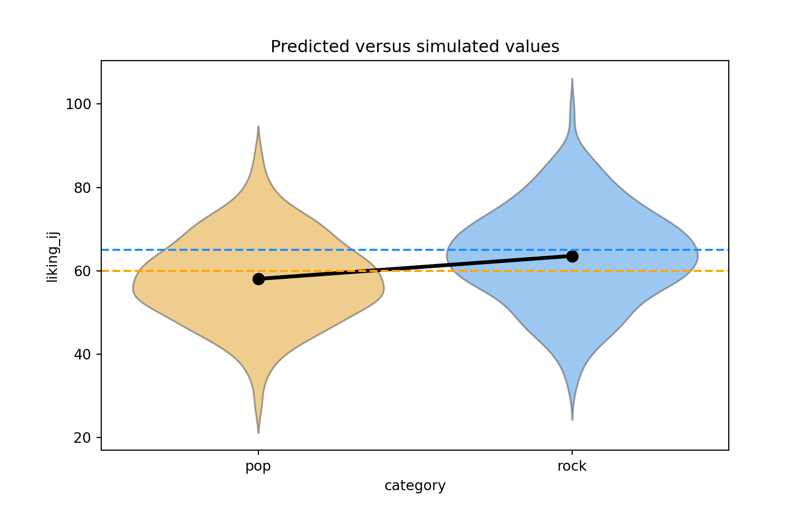
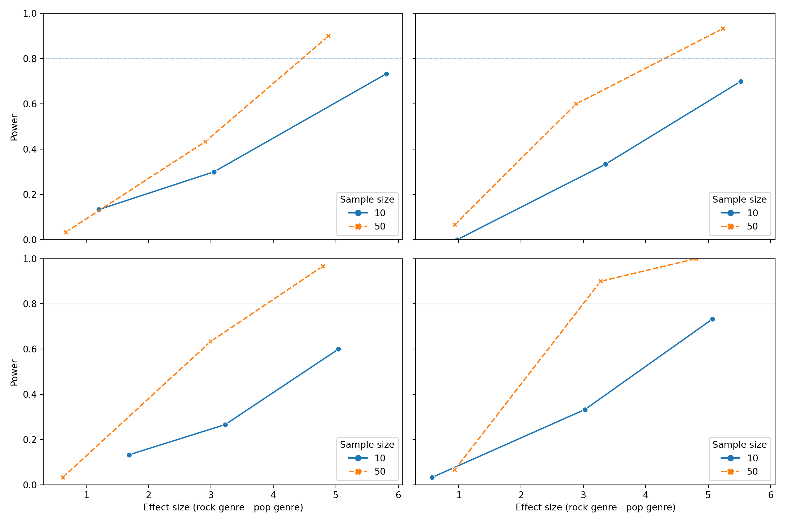

# Python

To begin with, the simulation-based power analysis in Python follows the structure in the last section in R, and there are repetitions in the text to describe the method. However, there are differences between the two languages; we will specify those discrepancies  in the following "note" parts.

## Setup

Note: There are two differences between Python and the R language:

1. R uses the p_load function to automatically install missing libraries and import libraries. Python needs to manually configure the environment. If the library is missing, you can use “! pip install [package_name]” to install;
2. The R has set parallelism in the setup part, but Python uses the dask package to perform parallel computing in the simulation part.

We will need to use several Python packages to optimize our workflow and fit mixed effects models.


```python
import statsmodels.formula.api as smf
import numpy as np
import pandas as pd
import seaborn as sns
import matplotlib
import matplotlib.pyplot as plt
import dask
import time

from dask.distributed import Client
from itertools import product

matplotlib.use("Agg")
```
We will also set the pseudo-random number generator seed to 2138 to make the stochastic components of our simulations reproducible.


```python
np.random.seed(2138)
```

## Data simulation step by step

To give an overview of the power simulation task, we will simulate data from a design with crossed random factors of subjects and songs (see Power of What? for design details), fit a model to the simulated data, recover from the model output the parameter values we put in, calculate power, and finally automate the whole process so that we can calculate power for different effect sizes. Much of the general workflow here is borrowed from DeBruine & Dale (2021) Understanding Mixed-Effects Models through Simulation. We’ll start by writing code that simulates datasets under the alternative hypothesis.

Note: There are two differences between Python and the R:

1. We use the package of "statsmodels" to set up the mixd effect model in Python. However, this package doesn't have extension to show the correlation between the random intercept and the random slope of the subject like that in R;
2. There's no "broom.mixed::tidy()" function in Python and that's why the output is incomplete.

### Establish the simulation parameters

Before we start, let’s set some global parameters for our power simulations. Since simulations can take a long time to run, we’ll use 30 replications here as an example, but we recommend increasing this number to at least 1000 replications for a more accurate final power calculation.


```python
# number of simulation replicates for power calculation
reps = 30

# specified alpha for power calculation
alpha = 0.05
```

### Establish the data-generating parameters

The first thing to do is to set up the parameters that govern the process we assume gave rise to the data - the data-generating process, or DGP. We previously decided upon the the data-generating parameters (see Power of What?), so we just need to code them here.


```python
# set all data-generating parameters
beta_0 = 60  # intercept; i.e., the grand mean
beta_1 = 5   # slope; i.e, effect of category
omega_0 = 3  # by-song random intercept sd
tau_0 = 7    # by-subject random intercept sd
tau_1 = 4    # by-subject random slope sd
rho = 0.2    # correlation between intercept and slope
sigma = 8    # residual (error) sd
```

### Simulate the sampling process
Next, we will simulate the sampling process for the data. First, let’s define parameters related to the number of observations.


```python
# set number of subjects and songs
n_subj = 25  # number of subjects
n_pop = 15   # number of songs in pop category
n_rock = 15  # number of songs in rock category
```

#### Simulate the sampling of songs

We need to create a table listing each song \(i\), which category it is in (rock or pop), and its random effect $O_{0i}$. The latter is sampled from a univariate normal distribution using the function np.random.normal().


```python
# simulate a sample of songs
songs = pd.DataFrame({
    'song_id': range(1, n_pop + n_rock + 1),
    'category': ['pop']*n_pop + ['rock']*n_rock,
    'genre_i': [0]*n_pop + [1]*n_rock,
    'O_0i': np.random.normal(0, omega_0, n_pop + n_rock)
})

print(songs.head(10))
```

```
##    song_id category  genre_i      O_0i
## 0        1      pop        0 -1.803722
## 1        2      pop        0 -4.618354
## 2        3      pop        0 -4.847097
## 3        4      pop        0 -1.097951
## 4        5      pop        0 -1.394909
## 5        6      pop        0  2.424235
## 6        7      pop        0 -3.956914
## 7        8      pop        0  0.873891
## 8        9      pop        0  3.318065
## 9       10      pop        0  5.513671
```

#### Simulate the sampling of subjects
Now we simulate the sampling of participants, which results in table listing each individual and their two correlated random effects (a random intercept and random slope). To do this, we must sample $T_{0j} ,T_{1j}$ pairs - one for each subject - from a bivariate normal distribution.

We will use the function np.random.multivariate_normal(), which generates a table of n simulated values from a multivariate normal distribution by specifying the means and covariance matrix(cov).


```python
# simulate a sample of subjects

# sample from a multivariate normal distribution
mean = [0, 0]  # means for random effects are always 0
cov = [[tau_0**2, rho*tau_0*tau_1], [rho*tau_0*tau_1, tau_1**2]]  # set covariance matrix

random_effects = np.random.multivariate_normal(mean, cov, n_subj)

subjects = pd.DataFrame(random_effects, columns=['T_0j', 'T_1j'])
subjects['subj_id'] = range(1, n_subj + 1) # add subject IDs

print(subjects.head(10))
```

```
##         T_0j      T_1j  subj_id
## 0  -0.547564 -2.796419        1
## 1 -10.695092 -3.700622        2
## 2   3.387493 -7.940628        3
## 3   4.344241  0.531463        4
## 4   6.461586  5.260280        5
## 5 -12.373764 -1.387928        6
## 6   0.352194 -3.990547        7
## 7  -6.962734  2.358670        8
## 8  -2.636463 -0.370637        9
## 9   0.619930 -4.416671       10
```

#### Check the simulated values

Let’s do a quick sanity check by comparing our simulated values to the parameters we used as inputs. Because the sampling process is stochastic, we shouldn’t expect that these will exactly match for any given run of the simulation.


```python
check_values = pd.DataFrame({
    'parameter': ['omega_0', 'tau_0', 'tau_1', 'rho'],
    'value': [omega_0, tau_0, tau_1, rho],
    'simulated': [songs['O_0i'].std(), subjects['T_0j'].std(), subjects['T_1j'].std(), subjects['T_0j'].corr(subjects['T_1j'])]
})

print(check_values)
```

```
##   parameter  value  simulated
## 0   omega_0    3.0   3.372345
## 1     tau_0    7.0   5.648262
## 2     tau_1    4.0   4.439518
## 3       rho    0.2   0.063860
```

#### Simulate trials

Since all subjects rate all songs (i.e., the design is fully crossed) we can set up a table of trials by including every possible combination of the rows in the subjects and songs tables. Each trial has random error associated with it, reflecting fluctuations in trial-by-trial ratings due to unknown factors. We simulate this by sampling values from a univariate normal distribution with a mean of 0 and a standard deviation of sigma.


```python
# cross subject and song IDs; add an error term
trials = subjects.assign(key=1).merge(songs.assign(key=1), on='key').drop(columns='key')
trials['e_ij'] = np.random.normal(0, sigma, len(trials))

print(trials.head(10))
```

```
##        T_0j      T_1j  subj_id  song_id category  genre_i      O_0i       e_ij
## 0 -0.547564 -2.796419        1        1      pop        0 -1.803722   6.954841
## 1 -0.547564 -2.796419        1        2      pop        0 -4.618354  -6.588163
## 2 -0.547564 -2.796419        1        3      pop        0 -4.847097   5.226969
## 3 -0.547564 -2.796419        1        4      pop        0 -1.097951 -11.285800
## 4 -0.547564 -2.796419        1        5      pop        0 -1.394909   2.418785
## 5 -0.547564 -2.796419        1        6      pop        0  2.424235  -7.579483
## 6 -0.547564 -2.796419        1        7      pop        0 -3.956914  -2.553524
## 7 -0.547564 -2.796419        1        8      pop        0  0.873891  12.726906
## 8 -0.547564 -2.796419        1        9      pop        0  3.318065  -6.371494
## 9 -0.547564 -2.796419        1       10      pop        0  5.513671  13.508966
```

#### Calculate response values

With this resulting trials table, in combination with the constants $\beta_0$ and $\beta_1$, we have the full set of values that we need to compute the response variable liking_ij according the linear model we defined previously (see Power of What?).


```python
dat_sim = trials.copy()
dat_sim['liking_ij'] = beta_0 + dat_sim['T_0j'] + dat_sim['O_0i'] + (beta_1 + dat_sim['T_1j']) * dat_sim['genre_i'] + dat_sim['e_ij']
dat_sim = dat_sim[['subj_id', 'song_id', 'category', 'genre_i', 'liking_ij']]

print(dat_sim.head(10))
```

```
##    subj_id  song_id category  genre_i  liking_ij
## 0        1        1      pop        0  64.603556
## 1        1        2      pop        0  48.245919
## 2        1        3      pop        0  59.832308
## 3        1        4      pop        0  47.068685
## 4        1        5      pop        0  60.476312
## 5        1        6      pop        0  54.297188
## 6        1        7      pop        0  52.941998
## 7        1        8      pop        0  73.053233
## 8        1        9      pop        0  56.399007
## 9        1       10      pop        0  78.475074
```

#### Plot the data

Let’s visualize the distribution of the response variable for each of the two song genres and superimpose the simulated parameter estimates for the means of these two groups.


```python
palette = {'pop': 'orange', 'rock': 'dodgerblue'}

# actual data
sns.violinplot(x='category', y='liking_ij', data=dat_sim, palette=palette, inner=None, alpha=0.5)
sns.pointplot(x='category', y='liking_ij', data=dat_sim, estimator=np.mean, ci=None, color='black')

# predicted means
plt.axhline(y=(beta_0 + 0*beta_1), color='orange', linestyle='dashed')
plt.axhline(y=(beta_0 + 1*beta_1), color='dodgerblue', linestyle='dashed')

plt.title("Predicted versus simulated values")
plt.show()
```



### Analyze the simulated data

Now we can analyze our simulated data in a linear mixed effects model using the function mixedlm from the {statsmodels} package. The formula and vc_formula in mixedlm() map onto how we calculated our liking_ij outcome variable above.

The terms in formula are as follows:
liking_ij is the response.
1 is the intercept ($\beta_0$), which is the mean of the response for the pop genre of songs (because we used dummy coding for the genre_i term).
genre_i is the dummy coded variable identifying whether song $i$ belongs to the pop or rock genre.

The terms in vc_formula are as follows:

- 0 + C(song_id)  specifies a song-specific random intercept O_0i.
- 0 + C(subject_id) specifies a subject-specific random intercept T_0j.
- 0 + C(subject_id):genre_i specifies the subject specific random slope of the genre category T_1j.

However, due to the inability of the function mixedlm(), the module did not indicate the correlation between subject-specific random intercept and the subject specific random slope of the genre category.


```python
# fit a linear mixed-effects model to data
form = 'liking_ij ~ 1 + genre_i'
dat_sim['groups'] = 1
vcf = {'song_id':'0 + C(song_id)', 'subj_id':'0 + C(subj_id)', 'genre_i': '0 + C(subj_id):genre_i'}
```

Now we can estimate the model.


```python
model = smf.mixedlm(form, groups=dat_sim['groups'], vc_formula=vcf, re_formula='0', data=dat_sim)
mod_sim = model.fit()

print(mod_sim.summary())
```

```
##          Mixed Linear Model Regression Results
## ========================================================
## Model:            MixedLM Dependent Variable: liking_ij 
## No. Observations: 750     Method:             REML      
## No. Groups:       1       Scale:              66.4110   
## Min. group size:  750     Log-Likelihood:     -2708.1155
## Max. group size:  750     Converged:          Yes       
## Mean group size:  750.0                                 
## --------------------------------------------------------
##               Coef.  Std.Err.   z    P>|z| [0.025 0.975]
## --------------------------------------------------------
## Intercept     58.078    1.494 38.873 0.000 55.150 61.007
## genre_i        5.505    1.631  3.376 0.001  2.309  8.701
## genre_i Var   22.355    1.106                           
## song_id Var   10.578    0.443                           
## subj_id Var   33.748    1.353                           
## ========================================================
```


```python
formatted_sim_result = pd.DataFrame({
    'term': ['Intercept', 'genre_i', '', '', '', '', ''],
    'parameter': ['beta_0', 'beta_1', 'omega_0', 'tau_0', 'rho', 'tau_1', 'sigma'],
    'value': [beta_0, beta_1, omega_0, tau_0, rho, tau_1, sigma],
    'simulated': [mod_sim.fe_params[0], mod_sim.fe_params[1],
                  '', '',
                 '', '',
                 '']
})

print(formatted_sim_result)
```

```
##         term parameter  value  simulated
## 0  Intercept    beta_0   60.0  58.078342
## 1    genre_i    beta_1    5.0   5.504843
## 2              omega_0    3.0           
## 3                tau_0    7.0           
## 4                  rho    0.2           
## 5                tau_1    4.0           
## 6                sigma    8.0
```

## Data simulation automated

Now that we’ve tested the data generating code, we can put it into a function so that it’s easy to run it repeatedly.


```python
def sim_data(n_subj=25, n_pop=15, n_rock=15, beta_0=60, beta_1=5, omega_0=3, tau_0=7, tau_1=4, rho=0.2, sigma=8):
    songs = pd.DataFrame({
        'song_id': np.arange(n_pop + n_rock),
        'category': np.repeat(["pop", "rock"], [n_pop, n_rock]),
        'genre_i': np.repeat([0, 1], [n_pop, n_rock]),
        'O_0i': np.random.normal(0, omega_0, n_pop + n_rock)
    })

    random_effects = np.random.multivariate_normal([0, 0], [[tau_0**2, rho*tau_0*tau_1], [rho*tau_0*tau_1, tau_1**2]], n_subj)
    subjects = pd.DataFrame(random_effects, columns=['T_0j', 'T_1j'])
    subjects['subj_id'] = np.arange(1, n_subj + 1)

    trials = pd.merge(subjects, songs, how='cross')
    trials['e_ij'] = np.random.normal(0, sigma, len(trials))
    trials['liking_ij'] = beta_0 + trials['T_0j'] + trials['O_0i'] + (beta_1 + trials['T_1j']) * trials['genre_i'] + trials['e_ij']

    return trials[['subj_id', 'song_id', 'category', 'genre_i', 'liking_ij']]
```

## Power calculation single run

We can wrap the data generating function and modeling code in a new function single_run() that returns a table of the analysis results for a single simulation run.


```python
def single_run(n_subj=25, n_pop=15, n_rock=15, beta_0=60, beta_1=5, omega_0=3, tau_0=7, tau_1=4, rho=0.2, sigma=8):
    dat_sim = sim_data(n_subj, n_pop, n_rock, beta_0, beta_1, omega_0, tau_0, tau_1, rho, sigma)

    dat_sim['groups'] = 1
    mod_sim = smf.mixedlm('liking_ij ~ 1 + genre_i', groups=dat_sim['groups'],
                          vc_formula={'song_id':'0 + C(song_id)', 'subj_id':'0 + C(subj_id)', 'genre_i': '0 + C(subj_id):genre_i'},
                          re_formula='0', data=dat_sim).fit()

    df = mod_sim.summary().tables[1]
    df['p_value'] = mod_sim.pvalues
    return df[['Coef.', 'Std.Err.', 'p_value']]
```

Let’s test that our new single_run() function performs as expected.


```python
# run one model with default parameters
print(single_run())
```

```
##               Coef. Std.Err.   p_value
## Intercept    62.364    1.620  0.000000
## genre_i       1.794    1.454  0.217012
## genre_i Var  15.056    0.854  0.027138
## song_id Var   8.783    0.387  0.004477
## subj_id Var  46.691    1.848  0.001541
```


```python
# run one model with new parameters
print(single_run(n_pop = 10, n_rock = 50, beta_1 = 2))
```

```
##               Coef. Std.Err.        p_value
## Intercept    60.065    1.635  1.824465e-295
## genre_i       2.934    1.308   2.494009e-02
## genre_i Var  14.922    0.811   1.634819e-02
## song_id Var   6.946    0.230   8.011783e-05
## subj_id Var  43.595    1.826   1.830974e-03
```

## Power calculation automated

To get an accurate estimation of power, we need to run the simulation many times. Here we use the package dask to parallelize existing code to speed up iterative processes.

We use dask.delayed function to decorate single_run() so that it operates lazily, then call the delayed version repeatedly using for statement, and finally call dask.compute function to get the result of simulations.

Note: There are two differences between Python and the R:

1. The R uses the “future_map_dfr() function” to use the single_run() function in a loop, and Python directly uses the “for” structure to do a loop;
2. The R sets parallel computing in the setup part, while Python uses the “dask” library for parallel computing.


```python
client = Client()

@dask.delayed
def delayed_single_run(n_subj=25, n_pop=15, n_rock=15, beta_0=60, beta_1=5, omega_0=3, tau_0=7, tau_1=4, rho=0.2, sigma=8):
    df = single_run(n_subj, n_pop, n_rock, beta_0, beta_1, omega_0, tau_0, tau_1, rho, sigma)
    df = df.assign(n_subj=n_subj, n_pop=n_pop, n_rock=n_rock, beta_1=beta_1)
    return df

sims = [delayed_single_run() for _ in range(reps)]
sims_result = client.gather(client.compute(sims))

sims_df = pd.concat(sims_result).reset_index().rename(columns={'index':'term'})
```
We can finally calculate power for our parameter of interest $\beta_1$ denoted in the model output table as the term $genre_{i}$ by filtering to keep only that term and the calculating the proportion of times the \(p\)-value is below the alpha (0.05) threshold.


```python
genre_i_sims = sims_df[sims_df['term'] == 'genre_i']
mean_estimate = genre_i_sims['Coef.'].astype(float).mean()
mean_se = genre_i_sims['Std.Err.'].astype(float).mean()
power = (genre_i_sims['p_value'].astype(float) < alpha).mean()

print(f"Mean estimate: {mean_estimate}")
```

```
## Mean estimate: 4.964333333333332
```

```python
print(f"Mean standard error: {mean_se}")
```

```
## Mean standard error: 1.5052333333333332
```

```python
print(f"Power: {power}")
```

```
## Power: 0.9333333333333333
```

### Check false positive rate

We can do a sanity check to see if our simulation is performing as expected by checking the false positive rate (Type I error rate). We set the effect of genre_ij (beta_1) to 0 to calculate the false positive rate, which is the probability of concluding there is an effect when there is no actual effect in the population.


```python
sims_fp = [delayed_single_run(beta_1=0) for _ in range(reps)]
sims_fp_result = client.gather(client.compute(sims_fp))

sims_fp_df = pd.concat(sims_fp_result).reset_index().rename(columns={'index':'term'})
```


```python
print((sims_fp_df[sims_fp_df['term'] == 'genre_i']['p_value'].astype(float) < alpha).mean())
```

```
## 0.0
```

Ideally, the false positive rate will be equal to alpha, which we set at 0.05.


## Power for different effect sizes

In real life, we will not know the effect size of our quantity of interest and so we will need to repeatedly perform the power analysis over a range of different plausible effect sizes. Perhaps we might also want to calculate power as we vary other data-generating parameters, such as the number of pop and rock songs sampled and the number of subjects sampled. We can create a table that combines all combinations of the parameters we want to vary in a grid.

Note: There are two differences between Python and the R:

1. Python uses the “product” function to permutate and combine parameters and then uses “loop” and “dask.compute” to perform parallel computing;
2. Python couldn’t repeatedly use parameter_search() and instead uses two layers of the loop to realize multiple simulations of each permutation and combination of parameters.
 

```python
 # grid of parameter values of interest
params = {
    'n_subj': [10, 50],
    'n_pop': [10, 40],
    'n_rock': [10, 40],
    'beta_1': [1, 3, 5]
}
```

We can now wrap delayed_single_run() function within a more general function parameter_search() that takes the grid of parameter values as input and uses the for a statement to iterate over each row of parameter values in pgrid and feed them into delayed_single_run().


```python
# fit the models over the parameters
def parameter_search(params):
    sims = []
    pgrid = pd.DataFrame(list(product(*params.values())), columns=params.keys())

    # iterate over the grid of parameter values
    for _, row in pgrid.iterrows():
        sims.append(delayed_single_run(
            n_subj=row['n_subj'], # plug each row of parameter values into single_run()
            n_pop=row['n_pop'],
            n_rock=row['n_rock'],
            beta_1=row['beta_1']
        ))
    return pd.concat(client.gather(client.compute(sims))).reset_index().rename(columns={'index':'term'})
```

If we call parameter_search(), it will return a single replication of simulations for each combination of parameter values in pgrid.


```python
print(parameter_search(params))
```

```
##             term    Coef. Std.Err.       p_value  n_subj  n_pop  n_rock  beta_1
## 0      Intercept   57.106    3.631  9.647402e-56      10     10      10       1
## 1        genre_i    0.757    1.940  6.964514e-01      10     10      10       1
## 2    genre_i Var   12.208    2.044  4.799640e-01      10     10      10       1
## 3    song_id Var    5.574    0.396  9.570569e-02      10     10      10       1
## 4    subj_id Var  119.101   10.909  1.965629e-01      10     10      10       1
## ..           ...      ...      ...           ...     ...    ...     ...     ...
## 115    Intercept   60.531    1.263  0.000000e+00      50     40      40       5
## 116      genre_i    6.863    1.012  1.172492e-11      50     40      40       5
## 117  genre_i Var   15.101    0.501  1.229941e-04      50     40      40       5
## 118  song_id Var   13.197    0.665  1.142963e-02      50     40      40       5
## 119  subj_id Var   61.752    1.665  2.278029e-06      50     40      40       5
## 
## [120 rows x 8 columns]
```

To run multiple replications of simulations for each combination of parameter values in pgrid, we can use the for a statement to iterate over each row of parameter values in pgrid for the number of times specified by reps. Fair warning: this will take some time if you have set a high number of replications!


```python
sims_params = []
pgrid = pd.DataFrame(list(product(*params.values())), columns=params.keys())

for _ in range(reps):
    for _, row in pgrid.iterrows():
        sims_params.append(delayed_single_run(
            n_subj=row['n_subj'],
            n_pop=row['n_pop'],
            n_rock=row['n_rock'],
            beta_1=row['beta_1']
        ))

sims_params_result = client.gather(client.compute(sims_params))

sims_params_df = pd.concat(sims_params_result).reset_index().rename(columns={'index':'term'})
client.close()
print(sims_params_df)
```

```
##              term   Coef. Std.Err.        p_value  n_subj  n_pop  n_rock  beta_1
## 0       Intercept  63.117    2.060  3.021081e-206      10     10      10       1
## 1         genre_i   1.195    2.225   5.911703e-01      10     10      10       1
## 2     genre_i Var  33.604    3.001   1.776420e-01      10     10      10       1
## 3     song_id Var   1.062    0.317   6.864873e-01      10     10      10       1
## 4     subj_id Var  34.457    2.413   8.561448e-02      10     10      10       1
## ...           ...     ...      ...            ...     ...    ...     ...     ...
## 3595    Intercept  59.894    1.177   0.000000e+00      50     40      40       5
## 3596      genre_i   5.417    0.985   3.777745e-08      50     40      40       5
## 3597  genre_i Var  16.871    0.510   3.344605e-05      50     40      40       5
## 3598  song_id Var  11.375    0.257   2.675493e-08      50     40      40       5
## 3599  subj_id Var  53.483    1.403   1.700990e-06      50     40      40       5
## 
## [3600 rows x 8 columns]
```

Now, as before, we can calculate power. But this time, we’ll group by all of the parameters we manipulated in pgrid, so we can get power estimates for all combinations of parameter values.


```python
sims_table = sims_params_df.query("term == 'genre_i'").groupby(['term', 'n_subj', 'n_pop', 'n_rock', 'beta_1']).agg(
    mean_estimate=pd.NamedAgg(column='Coef.', aggfunc=lambda x: x.astype(float).mean()),
    mean_se=pd.NamedAgg(column='Std.Err.', aggfunc=lambda x: x.astype(float).mean()),
    power=pd.NamedAgg(column='p_value', aggfunc=lambda x: (x.astype(float) < alpha).mean())
).reset_index()
```
Here's a formatted table that summarizes the output from the power simulation.


```python
print(sims_table)
```

```
##        term  n_subj  n_pop  n_rock  beta_1  mean_estimate   mean_se     power
## 0   genre_i      10     10      10       1       1.860233  2.304167  0.166667
## 1   genre_i      10     10      10       3       3.383000  2.432767  0.300000
## 2   genre_i      10     10      10       5       4.579733  2.228967  0.466667
## 3   genre_i      10     10      40       1       0.680567  2.163200  0.000000
## 4   genre_i      10     10      40       3       3.212333  2.110667  0.266667
## 5   genre_i      10     10      40       5       5.592100  2.128300  0.700000
## 6   genre_i      10     40      10       1       1.128000  2.343100  0.033333
## 7   genre_i      10     40      10       3       2.836500  2.169833  0.200000
## 8   genre_i      10     40      10       5       4.934800  2.084233  0.733333
## 9   genre_i      10     40      40       1       0.510267  1.935767  0.000000
## 10  genre_i      10     40      40       3       2.840867  2.012100  0.266667
## 11  genre_i      10     40      40       5       4.764300  2.111433  0.600000
## 12  genre_i      50     10      10       1       0.602800  1.575633  0.066667
## 13  genre_i      50     10      10       3       2.496633  1.609067  0.400000
## 14  genre_i      50     10      10       5       5.187467  1.557300  0.900000
## 15  genre_i      50     10      40       1       0.443700  1.420800  0.033333
## 16  genre_i      50     10      40       3       2.930000  1.382433  0.566667
## 17  genre_i      50     10      40       5       5.353533  1.340100  0.966667
## 18  genre_i      50     40      10       1       0.953367  1.361667  0.066667
## 19  genre_i      50     40      10       3       3.229233  1.425400  0.633333
## 20  genre_i      50     40      10       5       5.421800  1.373667  1.000000
## 21  genre_i      50     40      40       1       1.010533  0.995900  0.166667
## 22  genre_i      50     40      40       3       3.082200  0.990033  0.866667
## 23  genre_i      50     40      40       5       4.902833  0.998700  1.000000
```

Here’s a graph that visualizes the output of the power simulation.


```python
# transform data type and create labels
sims_table['n_subj'] = sims_table['n_subj'].astype(str)
sims_table['n_pop'] = 'n_pop: ' + sims_table['n_pop'].astype(str)
sims_table['n_rock'] = 'n_rock: ' + sims_table['n_rock'].astype(str)

# plot
fig, axes = plt.subplots(len(sims_table['n_pop'].unique()), len(sims_table['n_rock'].unique()), figsize=(12, 8), sharex=True, sharey=True)
axes = axes.flatten()

# plot
for i, (pop, rock) in enumerate(sims_table.groupby(['n_pop', 'n_rock'])):
    ax = axes[i]
    sns.lineplot(data=rock, x='mean_estimate', y='power', hue='n_subj', style='n_subj', markers=True, ax=ax)
    ax.axhline(y=0.8, linestyle='dashed', linewidth=0.5)
    # ax.set_title(f'{pop} x {rock}')
    ax.set_xlabel('Effect size (rock genre - pop genre)')
    ax.set_ylabel('Power')
    ax.set_ylim(0, 1)
    ax.legend(title='Sample size')
```

```
## <Axes: xlabel='mean_estimate', ylabel='power'>
## <matplotlib.lines.Line2D object at 0x000002061718C210>
## Text(0.5, 0, 'Effect size (rock genre - pop genre)')
## Text(0, 0.5, 'Power')
## (0.0, 1.0)
## <matplotlib.legend.Legend object at 0x00000206174536D0>
## <Axes: xlabel='mean_estimate', ylabel='power'>
## <matplotlib.lines.Line2D object at 0x0000020617E1B950>
## Text(0.5, 0, 'Effect size (rock genre - pop genre)')
## Text(0, 0.5, 'Power')
## (0.0, 1.0)
## <matplotlib.legend.Legend object at 0x0000020616B8C150>
## <Axes: xlabel='mean_estimate', ylabel='power'>
## <matplotlib.lines.Line2D object at 0x0000020616FCC150>
## Text(0.5, 0, 'Effect size (rock genre - pop genre)')
## Text(0, 0.5, 'Power')
## (0.0, 1.0)
## <matplotlib.legend.Legend object at 0x0000020616BFB190>
## <Axes: xlabel='mean_estimate', ylabel='power'>
## <matplotlib.lines.Line2D object at 0x0000020616B8CB50>
## Text(0.5, 0, 'Effect size (rock genre - pop genre)')
## Text(0, 0.5, 'Power')
## (0.0, 1.0)
## <matplotlib.legend.Legend object at 0x0000020616FCBA90>
```

```python
# layout adjustmentS
plt.tight_layout()

# show the plot
plt.show()
```


