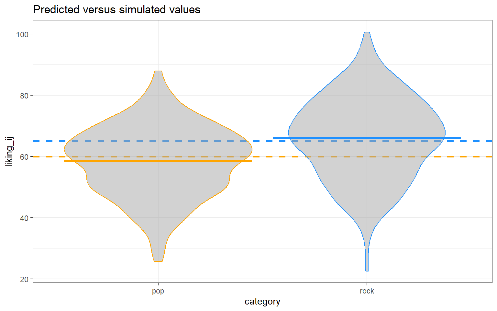

# Simulation-Based Power Analysis {-}

This tutorial is designed to be a quick-start guide for conducting simulation-based power analyses in R, Python, and Stata. We focus particularly on power for mixed effects models, but the principles employed can be repurposed for any model and study design. The tutorial is suitable for anyone with a intermediate understanding of mixed effects models and coding in either R, Python, or Stata.

While high-level packages exist in some of these languages for conducting simulation-based power analysis (e.g., the R packages [`{simr}`](https://cran.r-project.org/web/packages/simr/vignettes/fromscratch.html), [`{longpower}`](https://cran.r-project.org/web/packages/longpower/vignettes/longpower.html), and [`{simglm}`](https://cran.r-project.org/web/packages/simglm/vignettes/tidy_simulation.html)), such packages abstract away the details of conducting simulations and thus are best used after gaining an understanding of the power simulation process. In addition, rolling your own simulations from scratch provides much more flexibility to tackle different study designs and models - and it's fun!

We are always grateful for any feedback you are willing to provide about our tutorials! Please email <help@iq.harvard.edu> with any thoughts.

## Table of Contents {-}

1. [Canned Power Analysis](./power-analysis.html)
2. [Simulation-based Power Analysis](./simulation.html)
3. [Power of What?](./power-of-what.html)
4. [R Examples](./r.html)
5. [Python Examples](./python.html)
6. [Stata Examples](./stata.html)
7. [Software Comparison](./software-comparison.html)
8. [Resources](./resources.html)

\


## Contributors {-}

The contents of these workshops are the result of a collaborative effort from members of the [Data Science Services](http://dss.iq.harvard.edu) team at the Institute for Quantitative Social Science at Harvard University. The main contributors are Steve Worthington and Dan Yuan, with additional feedback from Jinjie Liu and Noah Greifer.

<!--chapter:end:index.Rmd-->


# (PART) Concepts {-}

# Power Analysis

<div class="alert alert-success">
Statistical power is the probability of rejecting a null hypothesis when it is false, or equivalently, of detecting an effect if such an effect exists.
</div>

## Canned routines

For some studies, it can be an important step to calculate *a priori* statistical power. We use statistical power to determine the probability of rejecting a null hypothesis when it is false, or equivalently, of detecting an effect if such an effect exists.

$$
\begin{align}
\textrm{Power} &= \textrm{Pr}(\textrm{reject} \, H_0 \, | \, H_0 \, \textrm{is false}) \\
               &= 1 - \textrm{Pr}(\textrm{fail to reject} \, H_0 \, | \, H_0 \, \textrm{is false}) \\
               &= 1 - \beta
\end{align}
$$

We want $\beta$ (Type II error) to be small and power to be large. When designing a study, rather than calculating power when sample size and effect size are fixed, researchers typically want to know the sample size required to reject a null hypothesis at a given level of power and effect size.

In some situations, where the study design and/or model of interest is fairly simple, we can use a formula to calculate the sample size required to reject a null hypothesis. We will use a simple example to show the process involved. For instance, if we plan to perform a test of an hypothesis comparing the cholesterol levels of people in two populations, one with a diet comprising low oat consumption and the other with high oat consumption, we could specify the following null and alternative hypotheses, respectively: 

$$
\begin{align}
\textrm{H}_0 : \mu_1 - \mu_2 &= 0 \\
\textrm{H}_1 : \mu_1 - \mu_2 &\neq 0
\end{align}
$$ 

where $\mu_1$ and $\mu_2$ are the mean cholesterol levels in the two populations being compared. We can use a formula to determine the sample sizes required so that the test has a specific power. We will need the following inputs to the formula:

1. $\alpha$ (Type I error / significance level): typically, this is set to $0.05$ in most studies.
2. $1 - \beta$ (power): often this is set to $0.8$ or $0.9$.
3. $\sigma$ (population standard deviation): we need to estimate/guess this.
4. $\delta$ (alternative hypothesis): ideally the smallest difference $\delta = \mu_1 - \mu_2$ that has scientific or clinical importance.

Given $\alpha$, $(1 - \beta)$, $\sigma$, and $\delta$, we can calculate $n_g$ the sample size in each group to reject $\textrm{H}_0$ with probability $(1 - \beta)$. To simplify things a little, we will use the normal distribution as an approximation to the $t$ distribution (which should be fine when $n_g \geq 30$). Here is the formula for this approximate two-sample $t$-test:

$$
n_g \approx 2(z_{\alpha / 2} + z_\beta)^2 \left( \frac{\sigma}{\delta} \right)^2
$$

where $n_g$ is the sample size required in each group, $z_{\alpha/2}$ is the value from the standard normal distribution holding half the selected $\alpha$ level below it (because this is a two-tailed test), $z_\beta$ is the value from the standard normal distribution holding the $\beta$ level below it, $\delta$ is the effect size (the difference in population averages $\mu_1 - \mu_2$ of cholesterol), and $\sigma$ is the pooled population standard deviation (during study planning we usually assume equal variances in the two groups). Typically, we would set $\alpha$ and $\beta$ to the following values and rely on previous studies or pilot data to obtain reasonable values for $\sigma$ and $\delta$:

1. $\alpha = 0.05$, so $z_{\alpha / 2} = 1.960$.
2. $1 - \beta = 0.8$, so $\beta = 0.2$, so $z_\beta = 0.8416$.
3. $\sigma = 1$; this could be our best guess based on previous studies.
4. $\delta = 0.7$, our best guess based on previous studies could be that mean differences of 0.7 mmol/L or greater should be considered biologically important.

We can then plug these input values into our formula:

$$
n_g \approx 2(1.960 + 0.8416)^2 \left( \frac{1}{0.7} \right)^2 = 32.036
$$

We always round up to a whole number for sample size, so for this study we need 33 subjects per group, or $n=66$ in total.

In practice, we will often rely on software to perform the above calculation for us. In R we can use the `power.t.test()` function from the built-in `{stats}` package to calculate the sample size needed to reject the null hypothesis that $\textrm{H}_0 : \mu_1 - \mu_2 = 0$. We just need to pass the $n$ parameter as `NULL` to tell R that we'd like to calculate sample size based on the values of the other parameters:


```r
power.t.test(n=NULL, delta=0.7, sd=1, sig.level=0.05, power=0.8, alternative="two.sided")
```

```
## 
##      Two-sample t test power calculation 
## 
##               n = 33.02467
##           delta = 0.7
##              sd = 1
##       sig.level = 0.05
##           power = 0.8
##     alternative = two.sided
## 
## NOTE: n is number in *each* group
```


## Step by step

Here are the general set of steps required to implement a power analysis for most study designs:

**1. Specify a hypothesis test.**

Make explicit a null and alternative hypothesis.

**2. Specify Type I and Type II error levels for the test.**

Typically, the Type I error level (significance level / false positive level) is set to $\alpha=0.05$ and Type II error level (false negative level) $\beta=0.2$, which yields a power level of $1 - \beta = 0.8$, but other values could be substituted instead.

**3. Specify the estimated effect size level for the test.**

To solve for sample size $n$, we need an estimate of effect size ($\delta = \mu_1 - \mu_2$) that has scientific meaning. Sometimes we need to use a pilot dataset or look to previous studies to get this value.

**4. Calculate the sample size required to obtain the power level desired.**

This can either be done by pugging and chugging values into the relevant formula, or by using a software-based implementation of said formula.

<!--chapter:end:01_canned.Rmd-->


# Simulation

## Customization

Formulas often do not exist to calculate power for the effect of interest and therefore canned functions/programs/macros may not be available. For some studies, such as those involving complex study designs or those using mixed effects models for inference, we must therefore rely on simulation to provide a means of generating estimates of power that are customized for our current situation. 

The basic idea is to simulate running our study many times and calculate the proportion of times we reject the null hypothesis. This proportion provides an estimate of power. Generating a dataset and running an analysis for the hypothesis test is part of the simulation. Randomness is introduced into the process during dataset generation.

For example, say the desired power level is 90%, and you want to calculate the sample size required to obtain this level of power. We could use the "guess sample size and check power" method. Firstly, choose a sample size $n_1$ and run the simulation to estimate power. If power is estimated to be lower than 90%, select a new value $n_2$ that is larger than $n_1$ and run the simulation again. Simulation runs are repeated until the estimated power is roughly 90%.

## Step by step

There are two broad steps involved in conducting simulation-based power analysis: 1) thinking and, 2) implementing. 

- Think 
    1. **Model specification:** Write down the regression model, including all variables and parameters of interest.
    2. **Variable composition:** Specify the form of the explanatory variables, such as the range of age or BMI, proportion of females/males, or the coding scheme used for categorical terms.
    3. **Parameter composition:** Establish reasonable values for the data-generating parameters in your model.

- Implement  
    4. **Simulate:** Simulate the sampling process for a single dataset, assuming the alternative hypothesis, and fit the model of interest.
    5. **Automate:** Write a function/program/macro to automate the process of creating datasets, fitting models, testing the hypothesis of interest, and calculating power for that test - the number of significant simulations out of the total number of simulations. The function/program/macro should be flexible enough to allow for iterating power calculations over a grid of different parameter values.
    6. **Summarize:** Summarize the relationships between power, sample size, and effect size in tables and figures.

The implementation phase can be summarized by the following graphic:


<!--chapter:end:02_simulation.Rmd-->


# (PART) Preparation {-}

# Power of What?

The initial steps of power simulation involve nothing more than thinking and writing down your thoughts using a pencil and paper. But, prior to walking through these steps, there is an even more fundamental issue to be addressed - the power of what?

What quantity within our model do we wish to calculate power for? Overall model goodness-of-fit, individual parameters, or combinations of parameters? The point of entry for power analysis is always to identify the particular effect of interest, and for that we must answer the question: "power of what?"

## Study design

The study design we will use as an example throughout this tutorial comes from Julian Quandt's blogpost (<https://julianquandt.com/post/power-analysis-by-data-simulation-in-r-part-iv/>). He describes this as:

> A new hypothetical research question focused on music preference. The overarching research goal will be to find out whether Rock or Pop music is better. Of course, we could just ask people what they prefer, but we want a more objective measure of what is Rock and Pop (people might have different ideas about the genres). Therefore, we will have participants listen to a bunch of different songs that are either from a Spotify "best-of-pop" or "best-of-rock" playlist and have them rate each song on an evaluation scale from 0-100 points. 

## Mixed effects model

Canned routines exist to perform power analysis for some simple general linear models (GLMs), however, for generalized linear mixed effects models (GLMMs) we must rely on simulation. We will walk through the process of simulating data for a GLMM in a step-by-step manner, which will serve as scaffolding to build intuition about how to conduct power simulation. Once we have the workflow down, we can automate the simulation process using functions. 

While the outcome in this example is bounded on the interval [0, 100], we will not concern ourselves with the issue of using a linear model with such an outcome. 


### Step 1: model specification

The first step in simulation-based power analysis is to write down the regression model of interest, including all variables and parameters:

$$
\textrm{liking}_{ij} = \beta_0 + T_{0j} + O_{0i} + (\beta_1 + T_{1j}) \times \textrm{genre}_i + \epsilon_{ij}
$$

where the subscripts $i$ and $j$ denote individual songs and participants, respectively, `liking` is an integer-based rating of a given song on the interval [0, 100], `genre` is a dummy coded binary variable indicating whether the song is classified as "rock" or "pop", and we assume $T_{0j} \sim \mathcal{N}(0, \tau_0)$, $T_{1j} \sim \mathcal{N}(0, \tau_1)$, $O_{0i} \sim \mathcal{N}(0, \omega_0)$, and $\epsilon_{ij} \sim \mathcal{N}(0, \sigma)$. The parameter of interest is $\beta_1$ - the average (within-subject) difference in the rating of songs between the two genres. Table 3.1 lists all of the variables and parameters in the model. 

Table: (\#tab:param-def) Variables in the data-generating model and associated code-based names.


model                    code                   description                                                     
-----------------------  ---------------------  ----------------------------------------------------------------
$\textrm{liking}_{ij}$   $\texttt{liking_ij}$   rating of song $i$ for participant $j$ on the interval [0, 100] 
$\textrm{genre}_i$       $\texttt{genre_i}$     genre of song $i$ (0='pop', 1='rock')                           
$\beta_0$                $\texttt{beta_0}$      intercept; mean of liking rating for 'pop' genre                
$\beta_1$                $\texttt{beta_1}$      slope; mean difference btw 'pop' and 'rock' song ratings        
$\tau_0$                 $\texttt{tau_0}$       standard deviation of by-subject random intercepts              
$\tau_1$                 $\texttt{tau_1}$       standard deviation of by-subject random slopes                  
$\rho$                   $\texttt{rho}$         correlation between by-subject random intercepts and slopes     
$\omega_0$               $\texttt{omega_0}$     standard deviation of by-song random intercepts                 
$\sigma$                 $\texttt{sigma}$       standard deviation of residuals                                 
$T_{0j}$                 $\texttt{T_0j}$        random intercept for subject $j$                                
$T_{1j}$                 $\texttt{T_1j}$        random slope for subject $j$                                    
$O_{0i}$                 $\texttt{O_0i}$        random intercept for song $i$                                   
$e_{ij}$                 $\texttt{e_ij}$        residual of song $i$ for participant $j$                        

### Step 2: Variable composition

Once we have the model equation, we need to specify the details of the explanatory variables. In our model, we only have a single binary predictor, so the only decision to make is which coding scheme to use: dummy coding, zero sum coding, or something else. Here, we chose dummy coding, since our primary interest is in the difference between the "rock" and "pop" genres. 

In many other situations, we might include variables such as age and sex in the model. In which case we would need to determine reasonable settings for the range of age and the proportion of females to males. For example, the range of age might encompass the full possible range of human longevity (e.g., 0 to 120 years) or could be more focused on non-retired adults (e.g., 18 to 65 years). The proportion of females to males could theoretically vary anywhere in the interval (0, 1), but practically is rarely outside of the interval [0.45, 0.55].

### Step 3: Parameter composition

Finally, we need to establish the data-generating parameters in the model. You may draw on your own, or your colleague's, substantive expertise about the phenomenom you're studying to determine what paramater values are plausible. Or, you might look to the literature for studies that examined similar effects. Table 3.2 lists parameter values we will use as a starting point. Later, we will try using some alternative values and compare power for each.

Table: (\#tab:param-all) Settings for all data-generating parameters.


code                 value   description                                                   
-------------------  ------  --------------------------------------------------------------
$\texttt{beta_0}$    60      intercept; i.e., mean of liking rating for 'pop' genre        
$\texttt{beta_1}$    5       slope; i.e, mean difference btw 'pop' and 'rock' song ratings 
$\texttt{tau_0}$     7       by-subject random intercept sd                                
$\texttt{tau_1}$     4       by-subject random slope sd                                    
$\texttt{rho}$       0.2     correlation between intercept and slope                       
$\texttt{omega_0}$   3       by-song random intercept sd                                   
$\texttt{sigma}$     8       residual (error) sd                                           

<!--chapter:end:03_power_of_what.Rmd-->


# (PART) Implementation {.unnumbered}

# R

## Setup

We will need to use several R packages to optimize our workflow and fit
mixed effects models. We can use the `p_load()` function from the
`{pacman}` library to automate installing these packages onto our
machine and then load them into our search path.


```r
# uncomment the line below to install the {pacman} library on your computer
# install.packages("pacman")

pacman::p_load(
  lme4,         # model specification / estimation
  lmerTest,     # provides p-values in the model output
  future,       # parallelization
  future.apply, # fast automation
  furrr,        # fast functional programming
  faux,         # simulate from multivariate normal distribution
  broom.mixed,  # extracting tidy data from model fits
  tidyverse,    # data wrangling and visualisation
  gt            # nice tables
  )

faux_options(verbose = FALSE)
```

We will also set the pseudo-random number generator seed to `02138` to
make the stochastic components of our simulations reproducible.


```r
set.seed(02138)
```

Finally, let's take advantage of background parallelization to speed-up
iterative processes.


```r
plan(multisession)
```

## Data simulation step by step

To give an overview of the power simulation task, we will simulate data
from a design with crossed random factors of subjects and songs (see
[Power of What?](./power-of-what.html) for design details), fit a model
to the simulated data, recover from the model output the parameter
values we put in, calculate power, and finally automate the whole
process so that we can calculate power for different effect sizes. Much
of the general workflow here is borrowed from [DeBruine & Dale (2021)
Understanding Mixed-Effects Models through
Simulation](https://journals.sagepub.com/doi/full/10.1177/2515245920965119).
We'll start by writing code that simulates datasets under the
alternative hypothesis.

### Establish the simulation parameters

Before we start, let's set some global parameters for our power
simulations. Since simulations can take a long time to run, we'll use
100 replications here as an example, but we recommend increasing this
number to at least 1000 replications for a more accurate final power
calculation.


```r
# number of simulation replicates for power calculation
reps <- 100

# specified alpha for power calculation
alpha <- 0.05
```

### Establish the data-generating parameters

The first thing to do is to set up the parameters that govern the
process we assume gave rise to the data - the *data-generating process*,
or DGP. We previously decided upon the the data-generating parameters
(see [Power of What?](./power-of-what.html)), so we just need to code
them here.


```r
# set all data-generating parameters
beta_0  <-  60   # intercept; i.e., the grand mean
beta_1  <-   5   # slope; i.e, effect of category
omega_0 <-   3   # by-song random intercept sd
tau_0   <-   7   # by-subject random intercept sd
tau_1   <-   4   # by-subject random slope sd
rho     <-   0.2 # correlation between intercept and slope
sigma   <-   8   # residual (error) sd
```

### Simulate the sampling process

Next, we will simulate the sampling process for the data. First, let's
define parameters related to the number of observations.


```r
# set number of subjects and songs
n_subj <-  25 # number of subjects
n_pop  <-  15 # number of songs in pop category
n_rock <-  15 # number of songs in rock category
```

#### Simulate the sampling of songs

We need to create a table listing each song $i$, which category it is in
(`rock` or `pop`), and its random effect $O_{0i}$. The latter is sampled
from a univariate normal distribution using the function `rnorm()`.


```r
# simulate a sample of songs
songs <- tibble(
  song_id = seq_len(n_pop + n_rock),
  category = rep(c("pop", "rock"), c(n_pop, n_rock)),
  genre_i = rep(c(0, 1), c(n_pop, n_rock)),
  O_0i = rnorm(n = n_pop + n_rock, mean = 0, sd = omega_0)
)

print(songs, n=10)
```

```
## # A tibble: 30 × 4
##    song_id category genre_i    O_0i
##      <int> <chr>      <dbl>   <dbl>
##  1       1 pop            0  0.0930
##  2       2 pop            0 -0.960 
##  3       3 pop            0 -2.40  
##  4       4 pop            0 -5.11  
##  5       5 pop            0  3.64  
##  6       6 pop            0  1.37  
##  7       7 pop            0 -8.10  
##  8       8 pop            0 -0.382 
##  9       9 pop            0 -3.41  
## 10      10 pop            0  5.14  
## # ℹ 20 more rows
```

#### Simulate the sampling of subjects

Now we simulate the sampling of participants, which results in table
listing each individual and their two correlated random effects (a
random intercept and random slope). To do this, we must sample
${T_{0j}, T_{1j}}$ pairs - one for each subject - from a bivariate
normal distribution.

We will use the function `faux::rnorm_multi()`, which generates a table
of `n` simulated values from a multivariate normal distribution by
specifying the means (`mu`) and standard deviations (`sd`) of each
variable, plus the correlations (`r`), which can be either a single
value (applied to all pairs), a correlation matrix, or a vector of the
values in the upper right triangle of the correlation matrix.


```r
# simulate a sample of subjects

# sample from a multivariate normal distribution
subjects <- faux::rnorm_multi(
    n = n_subj,
    mu = 0, # means for random effects are always 0
    sd = c(tau_0, tau_1), # set SDs
    r = rho, # set correlation
    varnames = c("T_0j", "T_1j")
  ) |>
  mutate(subj_id = seq_len(n_subj)) |> # add subject IDs
  as_tibble()

print(subjects, n=10)
```

```
## # A tibble: 25 × 3
##       T_0j   T_1j subj_id
##      <dbl>  <dbl>   <int>
##  1  -2.33   0.169       1
##  2   0.396  1.96        2
##  3  -8.48   0.716       3
##  4 -13.8   -5.05        4
##  5  -3.51  -1.16        5
##  6  -2.12  -4.99        6
##  7   9.44   7.00        7
##  8   3.96   3.05        8
##  9 -11.5   -3.29        9
## 10   4.76  -5.68       10
## # ℹ 15 more rows
```

#### Check the simulated values

Let's do a quick sanity check by comparing our simulated values to the
parameters we used as inputs. Because the sampling process is
stochastic, we shouldn't expect that these will exactly match for any
given run of the simulation.


```r
tibble(
  parameter = c("omega_0", "tau_0", "tau_1", "rho"),
  value = c(omega_0, tau_0, tau_1, rho),
  simulated = c(
    sd(songs$O_0i),
    sd(subjects$T_0j),
    sd(subjects$T_1j),
    cor(subjects$T_0j, subjects$T_1j)
  )
)
```

```
## # A tibble: 4 × 3
##   parameter value simulated
##   <chr>     <dbl>     <dbl>
## 1 omega_0     3       3.00 
## 2 tau_0       7       7.87 
## 3 tau_1       4       4.05 
## 4 rho         0.2     0.495
```

#### Simulate trials

Since all subjects rate all songs (i.e., the design is fully crossed) we
can set up a table of trials by including every possible combination of
the rows in the `subjects` and `songs` tables. Each trial has random
error associated with it, reflecting fluctuations in trial-by-trial
ratings due to unknown factors. We simulate this by sampling values from
a univariate normal distribution with a mean of 0 and a standard
deviation of `sigma`.


```r
# cross subject and song IDs; add an error term
trials <- crossing(subjects, songs) |>
  mutate(e_ij = rnorm(n(), mean = 0, sd = sigma))

print(trials, n=10)
```

```
## # A tibble: 750 × 8
##     T_0j   T_1j subj_id song_id category genre_i    O_0i  e_ij
##    <dbl>  <dbl>   <int>   <int> <chr>      <dbl>   <dbl> <dbl>
##  1 -14.2 -0.797      11       1 pop            0  0.0930 -2.07
##  2 -14.2 -0.797      11       2 pop            0 -0.960   5.46
##  3 -14.2 -0.797      11       3 pop            0 -2.40    5.79
##  4 -14.2 -0.797      11       4 pop            0 -5.11   -2.02
##  5 -14.2 -0.797      11       5 pop            0  3.64   16.5 
##  6 -14.2 -0.797      11       6 pop            0  1.37    3.92
##  7 -14.2 -0.797      11       7 pop            0 -8.10   11.9 
##  8 -14.2 -0.797      11       8 pop            0 -0.382  -6.91
##  9 -14.2 -0.797      11       9 pop            0 -3.41   -6.68
## 10 -14.2 -0.797      11      10 pop            0  5.14   -2.11
## # ℹ 740 more rows
```

#### Calculate response values

With this resulting `trials` table, in combination with the constants
`beta_0` and `beta_1`, we have the full set of values that we need to
compute the response variable `liking_ij` according the linear model we
defined previously (see [Power of What?](./power-of-what.html)).


```r
dat_sim <- trials |>
  mutate(liking_ij = beta_0 + T_0j + O_0i + (beta_1 + T_1j) * genre_i + e_ij) %>%
  select(subj_id, song_id, category, genre_i, liking_ij)

print(dat_sim, n=10)
```

```
## # A tibble: 750 × 5
##    subj_id song_id category genre_i liking_ij
##      <int>   <int> <chr>      <dbl>     <dbl>
##  1      11       1 pop            0      43.8
##  2      11       2 pop            0      50.3
##  3      11       3 pop            0      49.2
##  4      11       4 pop            0      38.7
##  5      11       5 pop            0      66.0
##  6      11       6 pop            0      51.1
##  7      11       7 pop            0      49.7
##  8      11       8 pop            0      38.5
##  9      11       9 pop            0      35.7
## 10      11      10 pop            0      48.8
## # ℹ 740 more rows
```

#### Plot the data

Let's visualize the distribution of the response variable for each of
the two song genres and superimpose the simulated parameter estimates
for the means of these two groups.


```r
dat_sim |>
ggplot(aes(category, liking_ij, color = category)) +
  # predicted means
  geom_hline(yintercept = (beta_0 + 0*beta_1),
             color = "orange", linetype = "dashed", linewidth = 1) +
  geom_hline(yintercept = (beta_0 + 1*beta_1),
             color = "dodgerblue", linetype = "dashed", linewidth = 1) +
  # actual data
  geom_violin(alpha = 0.5, show.legend = FALSE, fill = "grey65") +
  stat_summary(fun = mean, geom="crossbar", show.legend = FALSE) +
  scale_color_manual(values = c("orange", "dodgerblue")) +
  ggtitle("Predicted versus simulated values") +
  theme_bw()
```



### Analyze the simulated data

Now we can analyze our simulated data in a linear mixed effects model
using the function `lmer()` from the `{lmerTest}` package (which is a
wrapper around the `lmer()` function from the `{lme4}` package that
additionally provides $p$-values). The model formula in `lmer()` maps
onto how we calculated our `liking_ij` outcome variable above.


```r
form <- formula(liking_ij ~ 1 + genre_i + (1 | song_id) + (1 + genre_i | subj_id))
```

The terms in this R formula are as follows:

-   `liking_ij` is the response.
-   `1` is the intercept (`beta_0`), which is the mean of the response
    for the pop genre of songs (because we used dummy coding for the
    `genre_i` term).
-   `genre_i` is the dummy coded variable identifying whether song $i$
    belongs to the pop or rock genre.
-   `(1 | song_id)` specifies a song-specific random intercept (`O_0i`).
-   `(1 + genre_i | subj_id)` specifies a subject-specific random
    intercept (`T_0j`) plus the subject specific random slope of the
    genre category (`T_1j`).

Now we can estimate the model.


```r
# fit a linear mixed-effects model to data
mod_sim <- lmer(form, data = dat_sim)

summary(mod_sim, corr = FALSE)
```

```
## Linear mixed model fit by REML. t-tests use Satterthwaite's method [
## lmerModLmerTest]
## Formula: form
##    Data: dat_sim
## 
## REML criterion at convergence: 5392.5
## 
## Scaled residuals: 
##      Min       1Q   Median       3Q      Max 
## -3.00888 -0.66610  0.02982  0.64259  2.95212 
## 
## Random effects:
##  Groups   Name        Variance Std.Dev. Corr
##  song_id  (Intercept) 12.60    3.550        
##  subj_id  (Intercept) 57.18    7.562        
##           genre_i     22.98    4.793    0.45
##  Residual             62.81    7.926        
## Number of obs: 750, groups:  song_id, 30; subj_id, 25
## 
## Fixed effects:
##             Estimate Std. Error     df t value Pr(>|t|)    
## (Intercept)   58.474      1.815 37.775  32.216  < 2e-16 ***
## genre_i        7.501      1.713 40.857   4.379 8.09e-05 ***
## ---
## Signif. codes:  0 '***' 0.001 '**' 0.01 '*' 0.05 '.' 0.1 ' ' 1
```

We can use the `broom.mixed::tidy()` function to get a tidy table of the
results. This will prove to be super useful later when we need to
combine the output from hundreds of simulations to calculate power. We
will added columns for `parameter` and `value`, so we can compare the
estimate from the model to the parameters we used to simulate the data.


```r
# get a tidy table of results
broom.mixed::tidy(mod_sim) |>
  mutate(across(is.numeric, round, 3)) |>
  mutate(
    parameter = c("beta_0", "beta_1", "omega_0", "tau_0", "rho", "tau_1", "sigma"),
    value = c(beta_0, beta_1, omega_0, tau_0, rho, tau_1, sigma),
  ) |>
  select(term, parameter, value, estimate) |>
  knitr::kable()
```


|term                     |parameter | value| estimate|
|:------------------------|:---------|-----:|--------:|
|(Intercept)              |beta_0    |  60.0|   58.474|
|genre_i                  |beta_1    |   5.0|    7.501|
|sd__(Intercept)          |omega_0   |   3.0|    3.550|
|sd__(Intercept)          |tau_0     |   7.0|    7.562|
|cor__(Intercept).genre_i |rho       |   0.2|    0.451|
|sd__genre_i              |tau_1     |   4.0|    4.793|
|sd__Observation          |sigma     |   8.0|    7.926|

## Data simulation automated

Now that we've tested the data generating code, we can put it into a
function so that it's easy to run it repeatedly.


```r
# set up the custom data simulation function
sim_data <- function(
  n_subj     =  25,   # number of subjects
  n_pop      =  15,   # number of pop songs
  n_rock     =  15,   # number of rock songs
  beta_0     =  60,   # mean for pop genre
  beta_1     =   5,   # effect of genre
  omega_0    =   3,   # by-song random intercept sd
  tau_0      =   7,   # by-subject random intercept sd
  tau_1      =   4,   # by-subject random slope sd
  rho        =   0.2, # correlation between intercept and slope
  sigma      =   8    # residual (standard deviation)
  )
{
  # simulate a sample of songs
  songs <- tibble(
    song_id = seq_len(n_pop + n_rock),
    category = rep(c("pop", "rock"), c(n_pop, n_rock)),
    genre_i = rep(c(0, 1), c(n_pop, n_rock)),
    O_0i = rnorm(n = n_pop + n_rock, mean = 0, sd = omega_0)
  )

  # simulate a sample of subjects
  subjects <- faux::rnorm_multi(
    n = n_subj,
    mu = 0,
    sd = c(tau_0, tau_1),
    r = rho,
    varnames = c("T_0j", "T_1j")
  ) |>
  mutate(subj_id = seq_len(n_subj))

# cross subject and song IDs
crossing(subjects, songs) |>
  mutate(e_ij = rnorm(n(), mean = 0, sd = sigma),
         liking_ij = beta_0 + T_0j + O_0i + (beta_1 + T_1j) * genre_i + e_ij) |>
  select(subj_id, song_id, category, genre_i, liking_ij)
}
```

## Power calculation single run

We can wrap the data generating function and modeling code in a new
function `single_run()` that returns a tidy table of the analysis
results for a single simulation run. We'll suppress warnings and
messages from the modeling fitting process, as these sometimes occur
with simulation runs that generate extreme realized values for
parameters.


```r
# set up the power function
single_run <- function(...) {
  # ... is a shortcut that forwards any additional arguments to sim_data()
  dat_sim <- sim_data(...)
  mod_sim <- suppressWarnings({ suppressMessages({ # suppress singularity messages
    lmerTest::lmer(liking_ij ~ 1 + genre_i + (1 | song_id) + (1 + genre_i | subj_id), data = dat_sim)
  })})
  broom.mixed::tidy(mod_sim)
}
```

Let's test that our new `single_run()` function performs as expected.


```r
# run one model with default parameters
single_run()
```

```
## # A tibble: 7 × 8
##   effect   group    term            estimate std.error statistic    df   p.value
##   <chr>    <chr>    <chr>              <dbl>     <dbl>     <dbl> <dbl>     <dbl>
## 1 fixed    <NA>     (Intercept)       60.9        1.89     32.2   34.6  2.26e-27
## 2 fixed    <NA>     genre_i            4.23       1.58      2.68  39.9  1.08e- 2
## 3 ran_pars song_id  sd__(Intercept)    3.27      NA        NA     NA   NA       
## 4 ran_pars subj_id  sd__(Intercept)    8.24      NA        NA     NA   NA       
## 5 ran_pars subj_id  cor__(Intercep…    0.678     NA        NA     NA   NA       
## 6 ran_pars subj_id  sd__genre_i        4.37      NA        NA     NA   NA       
## 7 ran_pars Residual sd__Observation    7.73      NA        NA     NA   NA
```


```r
# run one model with new parameters
single_run(n_pop = 10, n_rock = 50, beta_1 = 2)
```

```
## # A tibble: 7 × 8
##   effect   group    term            estimate std.error statistic    df   p.value
##   <chr>    <chr>    <chr>              <dbl>     <dbl>     <dbl> <dbl>     <dbl>
## 1 fixed    <NA>     (Intercept)       57.0        1.97    29.0    44.9  1.05e-30
## 2 fixed    <NA>     genre_i            1.54       1.76     0.873  57.3  3.86e- 1
## 3 ran_pars song_id  sd__(Intercept)    3.46      NA       NA      NA   NA       
## 4 ran_pars subj_id  sd__(Intercept)    7.77      NA       NA      NA   NA       
## 5 ran_pars subj_id  cor__(Intercep…    0.210     NA       NA      NA   NA       
## 6 ran_pars subj_id  sd__genre_i        5.85      NA       NA      NA   NA       
## 7 ran_pars Residual sd__Observation    7.92      NA       NA      NA   NA
```

## Power calculation automated

To get an accurate estimation of power, we need to run the simulation
many times. Here we use the `future_map_dfr()` function to iterate over
a sequence of integers denoting the replications we want to perform.


```r
sims <- future_map_dfr(1:reps, ~ single_run())
```

We can finally calculate power for our parameter of interest
`beta_1`(denoted in the tidy model output table as the term `genre_i`)
by filtering to keep only that term and the calculating the proportion
of times the $p$-value is below the `alpha` (0.05) threshold.


```r
# calculate mean estimates and power for specified alpha
sims |>
  filter(term == "genre_i") |>
  group_by(term) |>
  summarise(
    mean_estimate = mean(estimate),
    mean_se = mean(std.error),
    power = mean(p.value < alpha),
    .groups = "drop"
  )
```

```
## # A tibble: 1 × 4
##   term    mean_estimate mean_se power
##   <chr>           <dbl>   <dbl> <dbl>
## 1 genre_i          4.97    1.47  0.88
```

### Check false positive rate

We can do a sanity check to see if our simulation is performing as
expected by checking the false positive rate (Type I error rate). We set
the effect of `genre_ij` (`beta_1`) to 0 to calculate the false positive
rate, which is the probability of concluding there is an effect when
there is no actual effect in the population.


```r
# run simulations and calculate the false positive rate
sims_fp <- future_map_dfr(1:reps, ~ single_run(beta_1 = 0))

# calculate mean estimates and power for specified alpha
sims_fp |>
  filter(term == "genre_i") |>
  summarise(power = mean(p.value < alpha))
```

```
## # A tibble: 1 × 1
##   power
##   <dbl>
## 1  0.05
```

Ideally, the false positive rate will be equal to `alpha`, which we set
at 0.05.

## Power for different effect sizes

In real life, we will not know the effect size of our quantity of
interest and so we will need to repeatedly perform the power analysis
over a range of different plausible effect sizes. Perhaps we might also
want to calculate power as we vary other data-generating parameters,
such as the number of pop and rock songs sampled and the number of
subjects sampled. We can create a table that combines all combinations
of the parameters we want to vary in a grid.


```r
# grid of parameter values of interest
pgrid <- crossing(
  n_subj = c(10, 25, 50),
  n_pop = c(10, 40),
  n_rock = c(10, 40),
  beta_1 = 1:5
)
```

We can now wrap our `single_run()` function within a more general
function `parameter_search()` that takes the grid of parameter values as
input and uses the `future_pmap_dfr()` function to iterate over each row
of parameter values in `pgrid` and feed them into `single_run()`.


```r
# fit the models over the parameters
parameter_search <- function(params = pgrid){
  future_pmap_dfr(
    .l = params, # iterate over the grid of parameter values
    .f = ~ single_run(
             n_subj = ..1, # plug each row of parameter values into single_run()
             n_pop  = ..2,
             n_rock = ..3,
             beta_1 = ..4
             ),
    .options = furrr_options(seed = TRUE),
    .progress = TRUE
  )
}
```

If we call `parameter_search()` it will return a single replication of
simulations for each combination of parameter values in `pgrid`.


```r
parameter_search()
```

```
## # A tibble: 420 × 8
##    effect   group    term           estimate std.error statistic    df   p.value
##    <chr>    <chr>    <chr>             <dbl>     <dbl>     <dbl> <dbl>     <dbl>
##  1 fixed    <NA>     (Intercept)      58.3        2.97    19.7    10.4  1.42e- 9
##  2 fixed    <NA>     genre_i          -0.383      1.98    -0.194  12.9  8.49e- 1
##  3 ran_pars song_id  sd__(Intercep…    2.62      NA       NA      NA   NA       
##  4 ran_pars subj_id  sd__(Intercep…    8.58      NA       NA      NA   NA       
##  5 ran_pars subj_id  cor__(Interce…   -0.708     NA       NA      NA   NA       
##  6 ran_pars subj_id  sd__genre_i       3.24      NA       NA      NA   NA       
##  7 ran_pars Residual sd__Observati…    8.62      NA       NA      NA   NA       
##  8 fixed    <NA>     (Intercept)      62.8        2.15    29.1    14.6  2.36e-14
##  9 fixed    <NA>     genre_i           1.75       2.13     0.820  16.8  4.24e- 1
## 10 ran_pars song_id  sd__(Intercep…    3.52      NA       NA      NA   NA       
## # ℹ 410 more rows
```

To run multiple replications of `parameter_search()`, we can use the
`future_replicate()` function, which just repeatedly calls
`parameter_search()` for the number of times specified by `reps`. Fair
warning, this will take some time if you have set a high number of
replications!


```r
# replicate the parameter grid to match the dimensions of the model outputs
pgrid_expand <- pgrid |>
  slice(rep(1:n(), each = 7)) |> # replicate each row by 7 parameters
  map_df(rep.int, times = reps) # replicate the whole grid by number of reps

# replicate the parameter search many times
sims_params <- future_replicate(
    n = reps,
    expr = parameter_search(),
    simplify = FALSE
    ) |>
  imap( ~ mutate(.x, rep = .y, .before = "effect")) |> # include rep ID
  bind_rows() |> # combine into a single tibble
  mutate(pgrid_expand, .before = "effect") # add in the parameter grid values
```

Now, as before, we can calculate power. But this time we'll group by all
of the parameters we manipulated in `pgrid`, so that we can get power
estimates for all combinations of parameter values.


```r
sims_table <- sims_params |>
  filter(term == "genre_i") |>
  group_by(term, n_subj, n_pop, n_rock, beta_1) |>
  summarise(
    mean_estimate = mean(estimate),
    mean_se = mean(std.error),
    power = mean(p.value < alpha),
    .groups = "drop"
  )
```

Here's a graph that visualizes the output of the power simulation.


```r
sims_table |>
  mutate(across(n_subj:beta_1, as.factor),
         n_pop = paste0("n_pop: ", n_pop),
         n_rock = paste0("n_rock: ", n_rock)) |>
  ggplot(aes(x = mean_estimate, y = power,
             group = n_subj, color = n_subj)) +
  geom_hline(yintercept = 0.8, linetype = "dashed",
             color = "grey50", linewidth =  0.5) +
  geom_line() +
  geom_point(size = 2) +
  facet_grid(n_pop ~ n_rock) +
  ylim(0, 1) +
  labs(x = "Effect size (rock genre - pop genre)",
       y = "Power",
       title = "Power analysis via simulation",
       color = "Sample size") +
  theme_bw()
```


Here's a nicely formatted table that summarizes the output from the
power simulation.


```r
sims_table |>
  gt() |>
  tab_header(title = "Power analysis via simulation") |>
  data_color(
    columns = power,
    fn = scales::col_numeric(
      palette = c("red", "green"),
      domain = c(0, 1)
      )
  )
```

```{=html}
<div id="peypicwoph" style="padding-left:0px;padding-right:0px;padding-top:10px;padding-bottom:10px;overflow-x:auto;overflow-y:auto;width:auto;height:auto;">
<style>#peypicwoph table {
  font-family: system-ui, 'Segoe UI', Roboto, Helvetica, Arial, sans-serif, 'Apple Color Emoji', 'Segoe UI Emoji', 'Segoe UI Symbol', 'Noto Color Emoji';
  -webkit-font-smoothing: antialiased;
  -moz-osx-font-smoothing: grayscale;
}

#peypicwoph thead, #peypicwoph tbody, #peypicwoph tfoot, #peypicwoph tr, #peypicwoph td, #peypicwoph th {
  border-style: none;
}

#peypicwoph p {
  margin: 0;
  padding: 0;
}

#peypicwoph .gt_table {
  display: table;
  border-collapse: collapse;
  line-height: normal;
  margin-left: auto;
  margin-right: auto;
  color: #333333;
  font-size: 16px;
  font-weight: normal;
  font-style: normal;
  background-color: #FFFFFF;
  width: auto;
  border-top-style: solid;
  border-top-width: 2px;
  border-top-color: #A8A8A8;
  border-right-style: none;
  border-right-width: 2px;
  border-right-color: #D3D3D3;
  border-bottom-style: solid;
  border-bottom-width: 2px;
  border-bottom-color: #A8A8A8;
  border-left-style: none;
  border-left-width: 2px;
  border-left-color: #D3D3D3;
}

#peypicwoph .gt_caption {
  padding-top: 4px;
  padding-bottom: 4px;
}

#peypicwoph .gt_title {
  color: #333333;
  font-size: 125%;
  font-weight: initial;
  padding-top: 4px;
  padding-bottom: 4px;
  padding-left: 5px;
  padding-right: 5px;
  border-bottom-color: #FFFFFF;
  border-bottom-width: 0;
}

#peypicwoph .gt_subtitle {
  color: #333333;
  font-size: 85%;
  font-weight: initial;
  padding-top: 3px;
  padding-bottom: 5px;
  padding-left: 5px;
  padding-right: 5px;
  border-top-color: #FFFFFF;
  border-top-width: 0;
}

#peypicwoph .gt_heading {
  background-color: #FFFFFF;
  text-align: center;
  border-bottom-color: #FFFFFF;
  border-left-style: none;
  border-left-width: 1px;
  border-left-color: #D3D3D3;
  border-right-style: none;
  border-right-width: 1px;
  border-right-color: #D3D3D3;
}

#peypicwoph .gt_bottom_border {
  border-bottom-style: solid;
  border-bottom-width: 2px;
  border-bottom-color: #D3D3D3;
}

#peypicwoph .gt_col_headings {
  border-top-style: solid;
  border-top-width: 2px;
  border-top-color: #D3D3D3;
  border-bottom-style: solid;
  border-bottom-width: 2px;
  border-bottom-color: #D3D3D3;
  border-left-style: none;
  border-left-width: 1px;
  border-left-color: #D3D3D3;
  border-right-style: none;
  border-right-width: 1px;
  border-right-color: #D3D3D3;
}

#peypicwoph .gt_col_heading {
  color: #333333;
  background-color: #FFFFFF;
  font-size: 100%;
  font-weight: normal;
  text-transform: inherit;
  border-left-style: none;
  border-left-width: 1px;
  border-left-color: #D3D3D3;
  border-right-style: none;
  border-right-width: 1px;
  border-right-color: #D3D3D3;
  vertical-align: bottom;
  padding-top: 5px;
  padding-bottom: 6px;
  padding-left: 5px;
  padding-right: 5px;
  overflow-x: hidden;
}

#peypicwoph .gt_column_spanner_outer {
  color: #333333;
  background-color: #FFFFFF;
  font-size: 100%;
  font-weight: normal;
  text-transform: inherit;
  padding-top: 0;
  padding-bottom: 0;
  padding-left: 4px;
  padding-right: 4px;
}

#peypicwoph .gt_column_spanner_outer:first-child {
  padding-left: 0;
}

#peypicwoph .gt_column_spanner_outer:last-child {
  padding-right: 0;
}

#peypicwoph .gt_column_spanner {
  border-bottom-style: solid;
  border-bottom-width: 2px;
  border-bottom-color: #D3D3D3;
  vertical-align: bottom;
  padding-top: 5px;
  padding-bottom: 5px;
  overflow-x: hidden;
  display: inline-block;
  width: 100%;
}

#peypicwoph .gt_spanner_row {
  border-bottom-style: hidden;
}

#peypicwoph .gt_group_heading {
  padding-top: 8px;
  padding-bottom: 8px;
  padding-left: 5px;
  padding-right: 5px;
  color: #333333;
  background-color: #FFFFFF;
  font-size: 100%;
  font-weight: initial;
  text-transform: inherit;
  border-top-style: solid;
  border-top-width: 2px;
  border-top-color: #D3D3D3;
  border-bottom-style: solid;
  border-bottom-width: 2px;
  border-bottom-color: #D3D3D3;
  border-left-style: none;
  border-left-width: 1px;
  border-left-color: #D3D3D3;
  border-right-style: none;
  border-right-width: 1px;
  border-right-color: #D3D3D3;
  vertical-align: middle;
  text-align: left;
}

#peypicwoph .gt_empty_group_heading {
  padding: 0.5px;
  color: #333333;
  background-color: #FFFFFF;
  font-size: 100%;
  font-weight: initial;
  border-top-style: solid;
  border-top-width: 2px;
  border-top-color: #D3D3D3;
  border-bottom-style: solid;
  border-bottom-width: 2px;
  border-bottom-color: #D3D3D3;
  vertical-align: middle;
}

#peypicwoph .gt_from_md > :first-child {
  margin-top: 0;
}

#peypicwoph .gt_from_md > :last-child {
  margin-bottom: 0;
}

#peypicwoph .gt_row {
  padding-top: 8px;
  padding-bottom: 8px;
  padding-left: 5px;
  padding-right: 5px;
  margin: 10px;
  border-top-style: solid;
  border-top-width: 1px;
  border-top-color: #D3D3D3;
  border-left-style: none;
  border-left-width: 1px;
  border-left-color: #D3D3D3;
  border-right-style: none;
  border-right-width: 1px;
  border-right-color: #D3D3D3;
  vertical-align: middle;
  overflow-x: hidden;
}

#peypicwoph .gt_stub {
  color: #333333;
  background-color: #FFFFFF;
  font-size: 100%;
  font-weight: initial;
  text-transform: inherit;
  border-right-style: solid;
  border-right-width: 2px;
  border-right-color: #D3D3D3;
  padding-left: 5px;
  padding-right: 5px;
}

#peypicwoph .gt_stub_row_group {
  color: #333333;
  background-color: #FFFFFF;
  font-size: 100%;
  font-weight: initial;
  text-transform: inherit;
  border-right-style: solid;
  border-right-width: 2px;
  border-right-color: #D3D3D3;
  padding-left: 5px;
  padding-right: 5px;
  vertical-align: top;
}

#peypicwoph .gt_row_group_first td {
  border-top-width: 2px;
}

#peypicwoph .gt_row_group_first th {
  border-top-width: 2px;
}

#peypicwoph .gt_summary_row {
  color: #333333;
  background-color: #FFFFFF;
  text-transform: inherit;
  padding-top: 8px;
  padding-bottom: 8px;
  padding-left: 5px;
  padding-right: 5px;
}

#peypicwoph .gt_first_summary_row {
  border-top-style: solid;
  border-top-color: #D3D3D3;
}

#peypicwoph .gt_first_summary_row.thick {
  border-top-width: 2px;
}

#peypicwoph .gt_last_summary_row {
  padding-top: 8px;
  padding-bottom: 8px;
  padding-left: 5px;
  padding-right: 5px;
  border-bottom-style: solid;
  border-bottom-width: 2px;
  border-bottom-color: #D3D3D3;
}

#peypicwoph .gt_grand_summary_row {
  color: #333333;
  background-color: #FFFFFF;
  text-transform: inherit;
  padding-top: 8px;
  padding-bottom: 8px;
  padding-left: 5px;
  padding-right: 5px;
}

#peypicwoph .gt_first_grand_summary_row {
  padding-top: 8px;
  padding-bottom: 8px;
  padding-left: 5px;
  padding-right: 5px;
  border-top-style: double;
  border-top-width: 6px;
  border-top-color: #D3D3D3;
}

#peypicwoph .gt_last_grand_summary_row_top {
  padding-top: 8px;
  padding-bottom: 8px;
  padding-left: 5px;
  padding-right: 5px;
  border-bottom-style: double;
  border-bottom-width: 6px;
  border-bottom-color: #D3D3D3;
}

#peypicwoph .gt_striped {
  background-color: rgba(128, 128, 128, 0.05);
}

#peypicwoph .gt_table_body {
  border-top-style: solid;
  border-top-width: 2px;
  border-top-color: #D3D3D3;
  border-bottom-style: solid;
  border-bottom-width: 2px;
  border-bottom-color: #D3D3D3;
}

#peypicwoph .gt_footnotes {
  color: #333333;
  background-color: #FFFFFF;
  border-bottom-style: none;
  border-bottom-width: 2px;
  border-bottom-color: #D3D3D3;
  border-left-style: none;
  border-left-width: 2px;
  border-left-color: #D3D3D3;
  border-right-style: none;
  border-right-width: 2px;
  border-right-color: #D3D3D3;
}

#peypicwoph .gt_footnote {
  margin: 0px;
  font-size: 90%;
  padding-top: 4px;
  padding-bottom: 4px;
  padding-left: 5px;
  padding-right: 5px;
}

#peypicwoph .gt_sourcenotes {
  color: #333333;
  background-color: #FFFFFF;
  border-bottom-style: none;
  border-bottom-width: 2px;
  border-bottom-color: #D3D3D3;
  border-left-style: none;
  border-left-width: 2px;
  border-left-color: #D3D3D3;
  border-right-style: none;
  border-right-width: 2px;
  border-right-color: #D3D3D3;
}

#peypicwoph .gt_sourcenote {
  font-size: 90%;
  padding-top: 4px;
  padding-bottom: 4px;
  padding-left: 5px;
  padding-right: 5px;
}

#peypicwoph .gt_left {
  text-align: left;
}

#peypicwoph .gt_center {
  text-align: center;
}

#peypicwoph .gt_right {
  text-align: right;
  font-variant-numeric: tabular-nums;
}

#peypicwoph .gt_font_normal {
  font-weight: normal;
}

#peypicwoph .gt_font_bold {
  font-weight: bold;
}

#peypicwoph .gt_font_italic {
  font-style: italic;
}

#peypicwoph .gt_super {
  font-size: 65%;
}

#peypicwoph .gt_footnote_marks {
  font-size: 75%;
  vertical-align: 0.4em;
  position: initial;
}

#peypicwoph .gt_asterisk {
  font-size: 100%;
  vertical-align: 0;
}

#peypicwoph .gt_indent_1 {
  text-indent: 5px;
}

#peypicwoph .gt_indent_2 {
  text-indent: 10px;
}

#peypicwoph .gt_indent_3 {
  text-indent: 15px;
}

#peypicwoph .gt_indent_4 {
  text-indent: 20px;
}

#peypicwoph .gt_indent_5 {
  text-indent: 25px;
}
</style>
<table class="gt_table" data-quarto-disable-processing="false" data-quarto-bootstrap="false">
  <thead>
    <tr class="gt_heading">
      <td colspan="8" class="gt_heading gt_title gt_font_normal gt_bottom_border" style>Power analysis via simulation</td>
    </tr>
    
    <tr class="gt_col_headings">
      <th class="gt_col_heading gt_columns_bottom_border gt_left" rowspan="1" colspan="1" scope="col" id="term">term</th>
      <th class="gt_col_heading gt_columns_bottom_border gt_right" rowspan="1" colspan="1" scope="col" id="n_subj">n_subj</th>
      <th class="gt_col_heading gt_columns_bottom_border gt_right" rowspan="1" colspan="1" scope="col" id="n_pop">n_pop</th>
      <th class="gt_col_heading gt_columns_bottom_border gt_right" rowspan="1" colspan="1" scope="col" id="n_rock">n_rock</th>
      <th class="gt_col_heading gt_columns_bottom_border gt_right" rowspan="1" colspan="1" scope="col" id="beta_1">beta_1</th>
      <th class="gt_col_heading gt_columns_bottom_border gt_right" rowspan="1" colspan="1" scope="col" id="mean_estimate">mean_estimate</th>
      <th class="gt_col_heading gt_columns_bottom_border gt_right" rowspan="1" colspan="1" scope="col" id="mean_se">mean_se</th>
      <th class="gt_col_heading gt_columns_bottom_border gt_right" rowspan="1" colspan="1" scope="col" id="power">power</th>
    </tr>
  </thead>
  <tbody class="gt_table_body">
    <tr><td headers="term" class="gt_row gt_left">genre_i</td>
<td headers="n_subj" class="gt_row gt_right">10</td>
<td headers="n_pop" class="gt_row gt_right">10</td>
<td headers="n_rock" class="gt_row gt_right">10</td>
<td headers="beta_1" class="gt_row gt_right">1</td>
<td headers="mean_estimate" class="gt_row gt_right">0.6821340</td>
<td headers="mean_se" class="gt_row gt_right">2.1433713</td>
<td headers="power" class="gt_row gt_right" style="background-color: #F84200; color: #FFFFFF;">0.08</td></tr>
    <tr><td headers="term" class="gt_row gt_left">genre_i</td>
<td headers="n_subj" class="gt_row gt_right">10</td>
<td headers="n_pop" class="gt_row gt_right">10</td>
<td headers="n_rock" class="gt_row gt_right">10</td>
<td headers="beta_1" class="gt_row gt_right">2</td>
<td headers="mean_estimate" class="gt_row gt_right">1.7274589</td>
<td headers="mean_se" class="gt_row gt_right">2.1428328</td>
<td headers="power" class="gt_row gt_right" style="background-color: #F45500; color: #FFFFFF;">0.13</td></tr>
    <tr><td headers="term" class="gt_row gt_left">genre_i</td>
<td headers="n_subj" class="gt_row gt_right">10</td>
<td headers="n_pop" class="gt_row gt_right">10</td>
<td headers="n_rock" class="gt_row gt_right">10</td>
<td headers="beta_1" class="gt_row gt_right">3</td>
<td headers="mean_estimate" class="gt_row gt_right">2.7482126</td>
<td headers="mean_se" class="gt_row gt_right">2.1406312</td>
<td headers="power" class="gt_row gt_right" style="background-color: #ED6A00; color: #FFFFFF;">0.20</td></tr>
    <tr><td headers="term" class="gt_row gt_left">genre_i</td>
<td headers="n_subj" class="gt_row gt_right">10</td>
<td headers="n_pop" class="gt_row gt_right">10</td>
<td headers="n_rock" class="gt_row gt_right">10</td>
<td headers="beta_1" class="gt_row gt_right">4</td>
<td headers="mean_estimate" class="gt_row gt_right">3.6963509</td>
<td headers="mean_se" class="gt_row gt_right">2.1395978</td>
<td headers="power" class="gt_row gt_right" style="background-color: #E38200; color: #FFFFFF;">0.30</td></tr>
    <tr><td headers="term" class="gt_row gt_left">genre_i</td>
<td headers="n_subj" class="gt_row gt_right">10</td>
<td headers="n_pop" class="gt_row gt_right">10</td>
<td headers="n_rock" class="gt_row gt_right">10</td>
<td headers="beta_1" class="gt_row gt_right">5</td>
<td headers="mean_estimate" class="gt_row gt_right">4.6922276</td>
<td headers="mean_se" class="gt_row gt_right">2.1399928</td>
<td headers="power" class="gt_row gt_right" style="background-color: #CCA700; color: #000000;">0.48</td></tr>
    <tr><td headers="term" class="gt_row gt_left">genre_i</td>
<td headers="n_subj" class="gt_row gt_right">10</td>
<td headers="n_pop" class="gt_row gt_right">10</td>
<td headers="n_rock" class="gt_row gt_right">40</td>
<td headers="beta_1" class="gt_row gt_right">1</td>
<td headers="mean_estimate" class="gt_row gt_right">0.7216763</td>
<td headers="mean_se" class="gt_row gt_right">1.8288711</td>
<td headers="power" class="gt_row gt_right" style="background-color: #FA3900; color: #FFFFFF;">0.06</td></tr>
    <tr><td headers="term" class="gt_row gt_left">genre_i</td>
<td headers="n_subj" class="gt_row gt_right">10</td>
<td headers="n_pop" class="gt_row gt_right">10</td>
<td headers="n_rock" class="gt_row gt_right">40</td>
<td headers="beta_1" class="gt_row gt_right">2</td>
<td headers="mean_estimate" class="gt_row gt_right">1.7059291</td>
<td headers="mean_se" class="gt_row gt_right">1.8322452</td>
<td headers="power" class="gt_row gt_right" style="background-color: #F55100; color: #FFFFFF;">0.12</td></tr>
    <tr><td headers="term" class="gt_row gt_left">genre_i</td>
<td headers="n_subj" class="gt_row gt_right">10</td>
<td headers="n_pop" class="gt_row gt_right">10</td>
<td headers="n_rock" class="gt_row gt_right">40</td>
<td headers="beta_1" class="gt_row gt_right">3</td>
<td headers="mean_estimate" class="gt_row gt_right">2.6756674</td>
<td headers="mean_se" class="gt_row gt_right">1.8421349</td>
<td headers="power" class="gt_row gt_right" style="background-color: #E57E00; color: #FFFFFF;">0.28</td></tr>
    <tr><td headers="term" class="gt_row gt_left">genre_i</td>
<td headers="n_subj" class="gt_row gt_right">10</td>
<td headers="n_pop" class="gt_row gt_right">10</td>
<td headers="n_rock" class="gt_row gt_right">40</td>
<td headers="beta_1" class="gt_row gt_right">4</td>
<td headers="mean_estimate" class="gt_row gt_right">3.7319609</td>
<td headers="mean_se" class="gt_row gt_right">1.8460865</td>
<td headers="power" class="gt_row gt_right" style="background-color: #CCA700; color: #000000;">0.48</td></tr>
    <tr><td headers="term" class="gt_row gt_left">genre_i</td>
<td headers="n_subj" class="gt_row gt_right">10</td>
<td headers="n_pop" class="gt_row gt_right">10</td>
<td headers="n_rock" class="gt_row gt_right">40</td>
<td headers="beta_1" class="gt_row gt_right">5</td>
<td headers="mean_estimate" class="gt_row gt_right">4.7424011</td>
<td headers="mean_se" class="gt_row gt_right">1.8396710</td>
<td headers="power" class="gt_row gt_right" style="background-color: #9FD200; color: #000000;">0.72</td></tr>
    <tr><td headers="term" class="gt_row gt_left">genre_i</td>
<td headers="n_subj" class="gt_row gt_right">10</td>
<td headers="n_pop" class="gt_row gt_right">40</td>
<td headers="n_rock" class="gt_row gt_right">10</td>
<td headers="beta_1" class="gt_row gt_right">1</td>
<td headers="mean_estimate" class="gt_row gt_right">0.8245941</td>
<td headers="mean_se" class="gt_row gt_right">1.8332649</td>
<td headers="power" class="gt_row gt_right" style="background-color: #FA3900; color: #FFFFFF;">0.06</td></tr>
    <tr><td headers="term" class="gt_row gt_left">genre_i</td>
<td headers="n_subj" class="gt_row gt_right">10</td>
<td headers="n_pop" class="gt_row gt_right">40</td>
<td headers="n_rock" class="gt_row gt_right">10</td>
<td headers="beta_1" class="gt_row gt_right">2</td>
<td headers="mean_estimate" class="gt_row gt_right">1.8476570</td>
<td headers="mean_se" class="gt_row gt_right">1.8308934</td>
<td headers="power" class="gt_row gt_right" style="background-color: #F35800; color: #FFFFFF;">0.14</td></tr>
    <tr><td headers="term" class="gt_row gt_left">genre_i</td>
<td headers="n_subj" class="gt_row gt_right">10</td>
<td headers="n_pop" class="gt_row gt_right">40</td>
<td headers="n_rock" class="gt_row gt_right">10</td>
<td headers="beta_1" class="gt_row gt_right">3</td>
<td headers="mean_estimate" class="gt_row gt_right">2.8841097</td>
<td headers="mean_se" class="gt_row gt_right">1.8234947</td>
<td headers="power" class="gt_row gt_right" style="background-color: #E57E00; color: #FFFFFF;">0.28</td></tr>
    <tr><td headers="term" class="gt_row gt_left">genre_i</td>
<td headers="n_subj" class="gt_row gt_right">10</td>
<td headers="n_pop" class="gt_row gt_right">40</td>
<td headers="n_rock" class="gt_row gt_right">10</td>
<td headers="beta_1" class="gt_row gt_right">4</td>
<td headers="mean_estimate" class="gt_row gt_right">3.9163802</td>
<td headers="mean_se" class="gt_row gt_right">1.8294477</td>
<td headers="power" class="gt_row gt_right" style="background-color: #C4B100; color: #000000;">0.53</td></tr>
    <tr><td headers="term" class="gt_row gt_left">genre_i</td>
<td headers="n_subj" class="gt_row gt_right">10</td>
<td headers="n_pop" class="gt_row gt_right">40</td>
<td headers="n_rock" class="gt_row gt_right">10</td>
<td headers="beta_1" class="gt_row gt_right">5</td>
<td headers="mean_estimate" class="gt_row gt_right">4.9206879</td>
<td headers="mean_se" class="gt_row gt_right">1.8285285</td>
<td headers="power" class="gt_row gt_right" style="background-color: #9FD200; color: #000000;">0.72</td></tr>
    <tr><td headers="term" class="gt_row gt_left">genre_i</td>
<td headers="n_subj" class="gt_row gt_right">10</td>
<td headers="n_pop" class="gt_row gt_right">40</td>
<td headers="n_rock" class="gt_row gt_right">40</td>
<td headers="beta_1" class="gt_row gt_right">1</td>
<td headers="mean_estimate" class="gt_row gt_right">1.1213453</td>
<td headers="mean_se" class="gt_row gt_right">1.4790176</td>
<td headers="power" class="gt_row gt_right" style="background-color: #F84200; color: #FFFFFF;">0.08</td></tr>
    <tr><td headers="term" class="gt_row gt_left">genre_i</td>
<td headers="n_subj" class="gt_row gt_right">10</td>
<td headers="n_pop" class="gt_row gt_right">40</td>
<td headers="n_rock" class="gt_row gt_right">40</td>
<td headers="beta_1" class="gt_row gt_right">2</td>
<td headers="mean_estimate" class="gt_row gt_right">2.1427686</td>
<td headers="mean_se" class="gt_row gt_right">1.4853952</td>
<td headers="power" class="gt_row gt_right" style="background-color: #E77900; color: #FFFFFF;">0.26</td></tr>
    <tr><td headers="term" class="gt_row gt_left">genre_i</td>
<td headers="n_subj" class="gt_row gt_right">10</td>
<td headers="n_pop" class="gt_row gt_right">40</td>
<td headers="n_rock" class="gt_row gt_right">40</td>
<td headers="beta_1" class="gt_row gt_right">3</td>
<td headers="mean_estimate" class="gt_row gt_right">3.1372541</td>
<td headers="mean_se" class="gt_row gt_right">1.4847813</td>
<td headers="power" class="gt_row gt_right" style="background-color: #CDA500; color: #000000;">0.47</td></tr>
    <tr><td headers="term" class="gt_row gt_left">genre_i</td>
<td headers="n_subj" class="gt_row gt_right">10</td>
<td headers="n_pop" class="gt_row gt_right">40</td>
<td headers="n_rock" class="gt_row gt_right">40</td>
<td headers="beta_1" class="gt_row gt_right">4</td>
<td headers="mean_estimate" class="gt_row gt_right">4.1692116</td>
<td headers="mean_se" class="gt_row gt_right">1.4875177</td>
<td headers="power" class="gt_row gt_right" style="background-color: #98D700; color: #000000;">0.75</td></tr>
    <tr><td headers="term" class="gt_row gt_left">genre_i</td>
<td headers="n_subj" class="gt_row gt_right">10</td>
<td headers="n_pop" class="gt_row gt_right">40</td>
<td headers="n_rock" class="gt_row gt_right">40</td>
<td headers="beta_1" class="gt_row gt_right">5</td>
<td headers="mean_estimate" class="gt_row gt_right">5.1915115</td>
<td headers="mean_se" class="gt_row gt_right">1.4906063</td>
<td headers="power" class="gt_row gt_right" style="background-color: #6EEC00; color: #000000;">0.88</td></tr>
    <tr><td headers="term" class="gt_row gt_left">genre_i</td>
<td headers="n_subj" class="gt_row gt_right">25</td>
<td headers="n_pop" class="gt_row gt_right">10</td>
<td headers="n_rock" class="gt_row gt_right">10</td>
<td headers="beta_1" class="gt_row gt_right">1</td>
<td headers="mean_estimate" class="gt_row gt_right">0.6206088</td>
<td headers="mean_se" class="gt_row gt_right">1.7168699</td>
<td headers="power" class="gt_row gt_right" style="background-color: #FB3300; color: #FFFFFF;">0.05</td></tr>
    <tr><td headers="term" class="gt_row gt_left">genre_i</td>
<td headers="n_subj" class="gt_row gt_right">25</td>
<td headers="n_pop" class="gt_row gt_right">10</td>
<td headers="n_rock" class="gt_row gt_right">10</td>
<td headers="beta_1" class="gt_row gt_right">2</td>
<td headers="mean_estimate" class="gt_row gt_right">1.6084364</td>
<td headers="mean_se" class="gt_row gt_right">1.7200867</td>
<td headers="power" class="gt_row gt_right" style="background-color: #F15E00; color: #FFFFFF;">0.16</td></tr>
    <tr><td headers="term" class="gt_row gt_left">genre_i</td>
<td headers="n_subj" class="gt_row gt_right">25</td>
<td headers="n_pop" class="gt_row gt_right">10</td>
<td headers="n_rock" class="gt_row gt_right">10</td>
<td headers="beta_1" class="gt_row gt_right">3</td>
<td headers="mean_estimate" class="gt_row gt_right">2.6187355</td>
<td headers="mean_se" class="gt_row gt_right">1.7234279</td>
<td headers="power" class="gt_row gt_right" style="background-color: #E08700; color: #FFFFFF;">0.32</td></tr>
    <tr><td headers="term" class="gt_row gt_left">genre_i</td>
<td headers="n_subj" class="gt_row gt_right">25</td>
<td headers="n_pop" class="gt_row gt_right">10</td>
<td headers="n_rock" class="gt_row gt_right">10</td>
<td headers="beta_1" class="gt_row gt_right">4</td>
<td headers="mean_estimate" class="gt_row gt_right">3.6035387</td>
<td headers="mean_se" class="gt_row gt_right">1.7198478</td>
<td headers="power" class="gt_row gt_right" style="background-color: #CDA500; color: #000000;">0.47</td></tr>
    <tr><td headers="term" class="gt_row gt_left">genre_i</td>
<td headers="n_subj" class="gt_row gt_right">25</td>
<td headers="n_pop" class="gt_row gt_right">10</td>
<td headers="n_rock" class="gt_row gt_right">10</td>
<td headers="beta_1" class="gt_row gt_right">5</td>
<td headers="mean_estimate" class="gt_row gt_right">4.5822773</td>
<td headers="mean_se" class="gt_row gt_right">1.7152229</td>
<td headers="power" class="gt_row gt_right" style="background-color: #98D700; color: #000000;">0.75</td></tr>
    <tr><td headers="term" class="gt_row gt_left">genre_i</td>
<td headers="n_subj" class="gt_row gt_right">25</td>
<td headers="n_pop" class="gt_row gt_right">10</td>
<td headers="n_rock" class="gt_row gt_right">40</td>
<td headers="beta_1" class="gt_row gt_right">1</td>
<td headers="mean_estimate" class="gt_row gt_right">0.9055907</td>
<td headers="mean_se" class="gt_row gt_right">1.4495971</td>
<td headers="power" class="gt_row gt_right" style="background-color: #F84200; color: #FFFFFF;">0.08</td></tr>
    <tr><td headers="term" class="gt_row gt_left">genre_i</td>
<td headers="n_subj" class="gt_row gt_right">25</td>
<td headers="n_pop" class="gt_row gt_right">10</td>
<td headers="n_rock" class="gt_row gt_right">40</td>
<td headers="beta_1" class="gt_row gt_right">2</td>
<td headers="mean_estimate" class="gt_row gt_right">1.8898537</td>
<td headers="mean_se" class="gt_row gt_right">1.4482416</td>
<td headers="power" class="gt_row gt_right" style="background-color: #EC6C00; color: #FFFFFF;">0.21</td></tr>
    <tr><td headers="term" class="gt_row gt_left">genre_i</td>
<td headers="n_subj" class="gt_row gt_right">25</td>
<td headers="n_pop" class="gt_row gt_right">10</td>
<td headers="n_rock" class="gt_row gt_right">40</td>
<td headers="beta_1" class="gt_row gt_right">3</td>
<td headers="mean_estimate" class="gt_row gt_right">2.8874405</td>
<td headers="mean_se" class="gt_row gt_right">1.4451125</td>
<td headers="power" class="gt_row gt_right" style="background-color: #C9AB00; color: #000000;">0.50</td></tr>
    <tr><td headers="term" class="gt_row gt_left">genre_i</td>
<td headers="n_subj" class="gt_row gt_right">25</td>
<td headers="n_pop" class="gt_row gt_right">10</td>
<td headers="n_rock" class="gt_row gt_right">40</td>
<td headers="beta_1" class="gt_row gt_right">4</td>
<td headers="mean_estimate" class="gt_row gt_right">3.9016062</td>
<td headers="mean_se" class="gt_row gt_right">1.4461336</td>
<td headers="power" class="gt_row gt_right" style="background-color: #95D800; color: #000000;">0.76</td></tr>
    <tr><td headers="term" class="gt_row gt_left">genre_i</td>
<td headers="n_subj" class="gt_row gt_right">25</td>
<td headers="n_pop" class="gt_row gt_right">10</td>
<td headers="n_rock" class="gt_row gt_right">40</td>
<td headers="beta_1" class="gt_row gt_right">5</td>
<td headers="mean_estimate" class="gt_row gt_right">4.8689765</td>
<td headers="mean_se" class="gt_row gt_right">1.4454748</td>
<td headers="power" class="gt_row gt_right" style="background-color: #65EF00; color: #000000;">0.90</td></tr>
    <tr><td headers="term" class="gt_row gt_left">genre_i</td>
<td headers="n_subj" class="gt_row gt_right">25</td>
<td headers="n_pop" class="gt_row gt_right">40</td>
<td headers="n_rock" class="gt_row gt_right">10</td>
<td headers="beta_1" class="gt_row gt_right">1</td>
<td headers="mean_estimate" class="gt_row gt_right">1.0219424</td>
<td headers="mean_se" class="gt_row gt_right">1.4336253</td>
<td headers="power" class="gt_row gt_right" style="background-color: #F45500; color: #FFFFFF;">0.13</td></tr>
    <tr><td headers="term" class="gt_row gt_left">genre_i</td>
<td headers="n_subj" class="gt_row gt_right">25</td>
<td headers="n_pop" class="gt_row gt_right">40</td>
<td headers="n_rock" class="gt_row gt_right">10</td>
<td headers="beta_1" class="gt_row gt_right">2</td>
<td headers="mean_estimate" class="gt_row gt_right">2.0103972</td>
<td headers="mean_se" class="gt_row gt_right">1.4328663</td>
<td headers="power" class="gt_row gt_right" style="background-color: #E57E00; color: #FFFFFF;">0.28</td></tr>
    <tr><td headers="term" class="gt_row gt_left">genre_i</td>
<td headers="n_subj" class="gt_row gt_right">25</td>
<td headers="n_pop" class="gt_row gt_right">40</td>
<td headers="n_rock" class="gt_row gt_right">10</td>
<td headers="beta_1" class="gt_row gt_right">3</td>
<td headers="mean_estimate" class="gt_row gt_right">2.9942518</td>
<td headers="mean_se" class="gt_row gt_right">1.4348602</td>
<td headers="power" class="gt_row gt_right" style="background-color: #CAA900; color: #000000;">0.49</td></tr>
    <tr><td headers="term" class="gt_row gt_left">genre_i</td>
<td headers="n_subj" class="gt_row gt_right">25</td>
<td headers="n_pop" class="gt_row gt_right">40</td>
<td headers="n_rock" class="gt_row gt_right">10</td>
<td headers="beta_1" class="gt_row gt_right">4</td>
<td headers="mean_estimate" class="gt_row gt_right">4.0128924</td>
<td headers="mean_se" class="gt_row gt_right">1.4346163</td>
<td headers="power" class="gt_row gt_right" style="background-color: #92DA00; color: #000000;">0.77</td></tr>
    <tr><td headers="term" class="gt_row gt_left">genre_i</td>
<td headers="n_subj" class="gt_row gt_right">25</td>
<td headers="n_pop" class="gt_row gt_right">40</td>
<td headers="n_rock" class="gt_row gt_right">10</td>
<td headers="beta_1" class="gt_row gt_right">5</td>
<td headers="mean_estimate" class="gt_row gt_right">5.0216769</td>
<td headers="mean_se" class="gt_row gt_right">1.4367690</td>
<td headers="power" class="gt_row gt_right" style="background-color: #38FA00; color: #000000;">0.97</td></tr>
    <tr><td headers="term" class="gt_row gt_left">genre_i</td>
<td headers="n_subj" class="gt_row gt_right">25</td>
<td headers="n_pop" class="gt_row gt_right">40</td>
<td headers="n_rock" class="gt_row gt_right">40</td>
<td headers="beta_1" class="gt_row gt_right">1</td>
<td headers="mean_estimate" class="gt_row gt_right">0.9529641</td>
<td headers="mean_se" class="gt_row gt_right">1.0960452</td>
<td headers="power" class="gt_row gt_right" style="background-color: #F06100; color: #FFFFFF;">0.17</td></tr>
    <tr><td headers="term" class="gt_row gt_left">genre_i</td>
<td headers="n_subj" class="gt_row gt_right">25</td>
<td headers="n_pop" class="gt_row gt_right">40</td>
<td headers="n_rock" class="gt_row gt_right">40</td>
<td headers="beta_1" class="gt_row gt_right">2</td>
<td headers="mean_estimate" class="gt_row gt_right">1.9357289</td>
<td headers="mean_se" class="gt_row gt_right">1.0964069</td>
<td headers="power" class="gt_row gt_right" style="background-color: #D49C00; color: #000000;">0.42</td></tr>
    <tr><td headers="term" class="gt_row gt_left">genre_i</td>
<td headers="n_subj" class="gt_row gt_right">25</td>
<td headers="n_pop" class="gt_row gt_right">40</td>
<td headers="n_rock" class="gt_row gt_right">40</td>
<td headers="beta_1" class="gt_row gt_right">3</td>
<td headers="mean_estimate" class="gt_row gt_right">2.9554635</td>
<td headers="mean_se" class="gt_row gt_right">1.0980189</td>
<td headers="power" class="gt_row gt_right" style="background-color: #9FD200; color: #000000;">0.72</td></tr>
    <tr><td headers="term" class="gt_row gt_left">genre_i</td>
<td headers="n_subj" class="gt_row gt_right">25</td>
<td headers="n_pop" class="gt_row gt_right">40</td>
<td headers="n_rock" class="gt_row gt_right">40</td>
<td headers="beta_1" class="gt_row gt_right">4</td>
<td headers="mean_estimate" class="gt_row gt_right">3.9530592</td>
<td headers="mean_se" class="gt_row gt_right">1.0980972</td>
<td headers="power" class="gt_row gt_right" style="background-color: #65EF00; color: #000000;">0.90</td></tr>
    <tr><td headers="term" class="gt_row gt_left">genre_i</td>
<td headers="n_subj" class="gt_row gt_right">25</td>
<td headers="n_pop" class="gt_row gt_right">40</td>
<td headers="n_rock" class="gt_row gt_right">40</td>
<td headers="beta_1" class="gt_row gt_right">5</td>
<td headers="mean_estimate" class="gt_row gt_right">4.9797585</td>
<td headers="mean_se" class="gt_row gt_right">1.0980008</td>
<td headers="power" class="gt_row gt_right" style="background-color: #1FFD00; color: #000000;">0.99</td></tr>
    <tr><td headers="term" class="gt_row gt_left">genre_i</td>
<td headers="n_subj" class="gt_row gt_right">50</td>
<td headers="n_pop" class="gt_row gt_right">10</td>
<td headers="n_rock" class="gt_row gt_right">10</td>
<td headers="beta_1" class="gt_row gt_right">1</td>
<td headers="mean_estimate" class="gt_row gt_right">0.8935373</td>
<td headers="mean_se" class="gt_row gt_right">1.5072281</td>
<td headers="power" class="gt_row gt_right" style="background-color: #F45500; color: #FFFFFF;">0.13</td></tr>
    <tr><td headers="term" class="gt_row gt_left">genre_i</td>
<td headers="n_subj" class="gt_row gt_right">50</td>
<td headers="n_pop" class="gt_row gt_right">10</td>
<td headers="n_rock" class="gt_row gt_right">10</td>
<td headers="beta_1" class="gt_row gt_right">2</td>
<td headers="mean_estimate" class="gt_row gt_right">1.8989927</td>
<td headers="mean_se" class="gt_row gt_right">1.5076401</td>
<td headers="power" class="gt_row gt_right" style="background-color: #ED6A00; color: #FFFFFF;">0.20</td></tr>
    <tr><td headers="term" class="gt_row gt_left">genre_i</td>
<td headers="n_subj" class="gt_row gt_right">50</td>
<td headers="n_pop" class="gt_row gt_right">10</td>
<td headers="n_rock" class="gt_row gt_right">10</td>
<td headers="beta_1" class="gt_row gt_right">3</td>
<td headers="mean_estimate" class="gt_row gt_right">2.8976098</td>
<td headers="mean_se" class="gt_row gt_right">1.5096626</td>
<td headers="power" class="gt_row gt_right" style="background-color: #D49C00; color: #000000;">0.42</td></tr>
    <tr><td headers="term" class="gt_row gt_left">genre_i</td>
<td headers="n_subj" class="gt_row gt_right">50</td>
<td headers="n_pop" class="gt_row gt_right">10</td>
<td headers="n_rock" class="gt_row gt_right">10</td>
<td headers="beta_1" class="gt_row gt_right">4</td>
<td headers="mean_estimate" class="gt_row gt_right">3.8978394</td>
<td headers="mean_se" class="gt_row gt_right">1.5063429</td>
<td headers="power" class="gt_row gt_right" style="background-color: #B2C200; color: #000000;">0.63</td></tr>
    <tr><td headers="term" class="gt_row gt_left">genre_i</td>
<td headers="n_subj" class="gt_row gt_right">50</td>
<td headers="n_pop" class="gt_row gt_right">10</td>
<td headers="n_rock" class="gt_row gt_right">10</td>
<td headers="beta_1" class="gt_row gt_right">5</td>
<td headers="mean_estimate" class="gt_row gt_right">4.9065649</td>
<td headers="mean_se" class="gt_row gt_right">1.5102823</td>
<td headers="power" class="gt_row gt_right" style="background-color: #65EF00; color: #000000;">0.90</td></tr>
    <tr><td headers="term" class="gt_row gt_left">genre_i</td>
<td headers="n_subj" class="gt_row gt_right">50</td>
<td headers="n_pop" class="gt_row gt_right">10</td>
<td headers="n_rock" class="gt_row gt_right">40</td>
<td headers="beta_1" class="gt_row gt_right">1</td>
<td headers="mean_estimate" class="gt_row gt_right">0.8624299</td>
<td headers="mean_se" class="gt_row gt_right">1.2642870</td>
<td headers="power" class="gt_row gt_right" style="background-color: #F55100; color: #FFFFFF;">0.12</td></tr>
    <tr><td headers="term" class="gt_row gt_left">genre_i</td>
<td headers="n_subj" class="gt_row gt_right">50</td>
<td headers="n_pop" class="gt_row gt_right">10</td>
<td headers="n_rock" class="gt_row gt_right">40</td>
<td headers="beta_1" class="gt_row gt_right">2</td>
<td headers="mean_estimate" class="gt_row gt_right">1.8966771</td>
<td headers="mean_se" class="gt_row gt_right">1.2632428</td>
<td headers="power" class="gt_row gt_right" style="background-color: #E48000; color: #FFFFFF;">0.29</td></tr>
    <tr><td headers="term" class="gt_row gt_left">genre_i</td>
<td headers="n_subj" class="gt_row gt_right">50</td>
<td headers="n_pop" class="gt_row gt_right">10</td>
<td headers="n_rock" class="gt_row gt_right">40</td>
<td headers="beta_1" class="gt_row gt_right">3</td>
<td headers="mean_estimate" class="gt_row gt_right">2.9027209</td>
<td headers="mean_se" class="gt_row gt_right">1.2631341</td>
<td headers="power" class="gt_row gt_right" style="background-color: #B8BD00; color: #000000;">0.60</td></tr>
    <tr><td headers="term" class="gt_row gt_left">genre_i</td>
<td headers="n_subj" class="gt_row gt_right">50</td>
<td headers="n_pop" class="gt_row gt_right">10</td>
<td headers="n_rock" class="gt_row gt_right">40</td>
<td headers="beta_1" class="gt_row gt_right">4</td>
<td headers="mean_estimate" class="gt_row gt_right">3.8651279</td>
<td headers="mean_se" class="gt_row gt_right">1.2660560</td>
<td headers="power" class="gt_row gt_right" style="background-color: #72EA00; color: #000000;">0.87</td></tr>
    <tr><td headers="term" class="gt_row gt_left">genre_i</td>
<td headers="n_subj" class="gt_row gt_right">50</td>
<td headers="n_pop" class="gt_row gt_right">10</td>
<td headers="n_rock" class="gt_row gt_right">40</td>
<td headers="beta_1" class="gt_row gt_right">5</td>
<td headers="mean_estimate" class="gt_row gt_right">4.8895942</td>
<td headers="mean_se" class="gt_row gt_right">1.2672331</td>
<td headers="power" class="gt_row gt_right" style="background-color: #2EFC00; color: #000000;">0.98</td></tr>
    <tr><td headers="term" class="gt_row gt_left">genre_i</td>
<td headers="n_subj" class="gt_row gt_right">50</td>
<td headers="n_pop" class="gt_row gt_right">40</td>
<td headers="n_rock" class="gt_row gt_right">10</td>
<td headers="beta_1" class="gt_row gt_right">1</td>
<td headers="mean_estimate" class="gt_row gt_right">0.9841072</td>
<td headers="mean_se" class="gt_row gt_right">1.2649184</td>
<td headers="power" class="gt_row gt_right" style="background-color: #F15E00; color: #FFFFFF;">0.16</td></tr>
    <tr><td headers="term" class="gt_row gt_left">genre_i</td>
<td headers="n_subj" class="gt_row gt_right">50</td>
<td headers="n_pop" class="gt_row gt_right">40</td>
<td headers="n_rock" class="gt_row gt_right">10</td>
<td headers="beta_1" class="gt_row gt_right">2</td>
<td headers="mean_estimate" class="gt_row gt_right">1.9939159</td>
<td headers="mean_se" class="gt_row gt_right">1.2657069</td>
<td headers="power" class="gt_row gt_right" style="background-color: #DD8D00; color: #FFFFFF;">0.35</td></tr>
    <tr><td headers="term" class="gt_row gt_left">genre_i</td>
<td headers="n_subj" class="gt_row gt_right">50</td>
<td headers="n_pop" class="gt_row gt_right">40</td>
<td headers="n_rock" class="gt_row gt_right">10</td>
<td headers="beta_1" class="gt_row gt_right">3</td>
<td headers="mean_estimate" class="gt_row gt_right">3.0015429</td>
<td headers="mean_se" class="gt_row gt_right">1.2671451</td>
<td headers="power" class="gt_row gt_right" style="background-color: #AEC600; color: #000000;">0.65</td></tr>
    <tr><td headers="term" class="gt_row gt_left">genre_i</td>
<td headers="n_subj" class="gt_row gt_right">50</td>
<td headers="n_pop" class="gt_row gt_right">40</td>
<td headers="n_rock" class="gt_row gt_right">10</td>
<td headers="beta_1" class="gt_row gt_right">4</td>
<td headers="mean_estimate" class="gt_row gt_right">3.9797475</td>
<td headers="mean_se" class="gt_row gt_right">1.2674822</td>
<td headers="power" class="gt_row gt_right" style="background-color: #7DE600; color: #000000;">0.84</td></tr>
    <tr><td headers="term" class="gt_row gt_left">genre_i</td>
<td headers="n_subj" class="gt_row gt_right">50</td>
<td headers="n_pop" class="gt_row gt_right">40</td>
<td headers="n_rock" class="gt_row gt_right">10</td>
<td headers="beta_1" class="gt_row gt_right">5</td>
<td headers="mean_estimate" class="gt_row gt_right">4.9817978</td>
<td headers="mean_se" class="gt_row gt_right">1.2696729</td>
<td headers="power" class="gt_row gt_right" style="background-color: #41F900; color: #000000;">0.96</td></tr>
    <tr><td headers="term" class="gt_row gt_left">genre_i</td>
<td headers="n_subj" class="gt_row gt_right">50</td>
<td headers="n_pop" class="gt_row gt_right">40</td>
<td headers="n_rock" class="gt_row gt_right">40</td>
<td headers="beta_1" class="gt_row gt_right">1</td>
<td headers="mean_estimate" class="gt_row gt_right">0.9598020</td>
<td headers="mean_se" class="gt_row gt_right">0.9119579</td>
<td headers="power" class="gt_row gt_right" style="background-color: #EC6C00; color: #FFFFFF;">0.21</td></tr>
    <tr><td headers="term" class="gt_row gt_left">genre_i</td>
<td headers="n_subj" class="gt_row gt_right">50</td>
<td headers="n_pop" class="gt_row gt_right">40</td>
<td headers="n_rock" class="gt_row gt_right">40</td>
<td headers="beta_1" class="gt_row gt_right">2</td>
<td headers="mean_estimate" class="gt_row gt_right">1.9561492</td>
<td headers="mean_se" class="gt_row gt_right">0.9104043</td>
<td headers="power" class="gt_row gt_right" style="background-color: #C2B200; color: #000000;">0.54</td></tr>
    <tr><td headers="term" class="gt_row gt_left">genre_i</td>
<td headers="n_subj" class="gt_row gt_right">50</td>
<td headers="n_pop" class="gt_row gt_right">40</td>
<td headers="n_rock" class="gt_row gt_right">40</td>
<td headers="beta_1" class="gt_row gt_right">3</td>
<td headers="mean_estimate" class="gt_row gt_right">2.9585712</td>
<td headers="mean_se" class="gt_row gt_right">0.9104248</td>
<td headers="power" class="gt_row gt_right" style="background-color: #60F100; color: #000000;">0.91</td></tr>
    <tr><td headers="term" class="gt_row gt_left">genre_i</td>
<td headers="n_subj" class="gt_row gt_right">50</td>
<td headers="n_pop" class="gt_row gt_right">40</td>
<td headers="n_rock" class="gt_row gt_right">40</td>
<td headers="beta_1" class="gt_row gt_right">4</td>
<td headers="mean_estimate" class="gt_row gt_right">3.9730888</td>
<td headers="mean_se" class="gt_row gt_right">0.9107468</td>
<td headers="power" class="gt_row gt_right" style="background-color: #1FFD00; color: #000000;">0.99</td></tr>
    <tr><td headers="term" class="gt_row gt_left">genre_i</td>
<td headers="n_subj" class="gt_row gt_right">50</td>
<td headers="n_pop" class="gt_row gt_right">40</td>
<td headers="n_rock" class="gt_row gt_right">40</td>
<td headers="beta_1" class="gt_row gt_right">5</td>
<td headers="mean_estimate" class="gt_row gt_right">4.9661969</td>
<td headers="mean_se" class="gt_row gt_right">0.9115207</td>
<td headers="power" class="gt_row gt_right" style="background-color: #00FF00; color: #000000;">1.00</td></tr>
  </tbody>
  
  
</table>
</div>
```

<!--chapter:end:04_R.Rmd-->


# Python

To begin with, the simulation-based power analysis in Python follows the structure in the last section in R, and there are repetitions in the text to describe the method. However, there are differences between the two languages; we will specify those discrepancies  in the following "note" parts.

## Setup

Note: There are two differences between Python and the R language:

1. R uses the p_load function to automatically install missing libraries and import libraries. Python needs to manually configure the environment. If the library is missing, you can use “! pip install [package_name]” to install;
2. The R has set parallelism in the setup part, but Python uses the dask package to perform parallel computing in the simulation part.

We will need to use several Python packages to optimize our workflow and fit mixed effects models.


```python
import statsmodels.formula.api as smf
import numpy as np
import pandas as pd
import seaborn as sns
import matplotlib
import matplotlib.pyplot as plt
import dask
import time

from dask.distributed import Client
from itertools import product

matplotlib.use("Agg")
```
We will also set the pseudo-random number generator seed to 2138 to make the stochastic components of our simulations reproducible.


```python
np.random.seed(2138)
```

## Data simulation step by step

To give an overview of the power simulation task, we will simulate data from a design with crossed random factors of subjects and songs (see Power of What? for design details), fit a model to the simulated data, recover from the model output the parameter values we put in, calculate power, and finally automate the whole process so that we can calculate power for different effect sizes. Much of the general workflow here is borrowed from DeBruine & Dale (2021) Understanding Mixed-Effects Models through Simulation. We’ll start by writing code that simulates datasets under the alternative hypothesis.

Note: There are two differences between Python and the R:

1. We use the package of "statsmodels" to set up the mixd effect model in Python. However, this package doesn't have extension to show the correlation between the random intercept and the random slope of the subject like that in R;
2. There's no "broom.mixed::tidy()" function in Python and that's why the output is incomplete.

### Establish the simulation parameters

Before we start, let’s set some global parameters for our power simulations. Since simulations can take a long time to run, we’ll use 30 replications here as an example, but we recommend increasing this number to at least 1000 replications for a more accurate final power calculation.


```python
# number of simulation replicates for power calculation
reps = 30

# specified alpha for power calculation
alpha = 0.05
```

### Establish the data-generating parameters

The first thing to do is to set up the parameters that govern the process we assume gave rise to the data - the data-generating process, or DGP. We previously decided upon the the data-generating parameters (see Power of What?), so we just need to code them here.


```python
# set all data-generating parameters
beta_0 = 60  # intercept; i.e., the grand mean
beta_1 = 5   # slope; i.e, effect of category
omega_0 = 3  # by-song random intercept sd
tau_0 = 7    # by-subject random intercept sd
tau_1 = 4    # by-subject random slope sd
rho = 0.2    # correlation between intercept and slope
sigma = 8    # residual (error) sd
```

### Simulate the sampling process
Next, we will simulate the sampling process for the data. First, let’s define parameters related to the number of observations.


```python
# set number of subjects and songs
n_subj = 25  # number of subjects
n_pop = 15   # number of songs in pop category
n_rock = 15  # number of songs in rock category
```

#### Simulate the sampling of songs

We need to create a table listing each song \(i\), which category it is in (rock or pop), and its random effect $O_{0i}$. The latter is sampled from a univariate normal distribution using the function np.random.normal().


```python
# simulate a sample of songs
songs = pd.DataFrame({
    'song_id': range(1, n_pop + n_rock + 1),
    'category': ['pop']*n_pop + ['rock']*n_rock,
    'genre_i': [0]*n_pop + [1]*n_rock,
    'O_0i': np.random.normal(0, omega_0, n_pop + n_rock)
})

print(songs.head(10))
```

```
##    song_id category  genre_i      O_0i
## 0        1      pop        0 -1.803722
## 1        2      pop        0 -4.618354
## 2        3      pop        0 -4.847097
## 3        4      pop        0 -1.097951
## 4        5      pop        0 -1.394909
## 5        6      pop        0  2.424235
## 6        7      pop        0 -3.956914
## 7        8      pop        0  0.873891
## 8        9      pop        0  3.318065
## 9       10      pop        0  5.513671
```

#### Simulate the sampling of subjects
Now we simulate the sampling of participants, which results in table listing each individual and their two correlated random effects (a random intercept and random slope). To do this, we must sample $T_{0j} ,T_{1j}$ pairs - one for each subject - from a bivariate normal distribution.

We will use the function np.random.multivariate_normal(), which generates a table of n simulated values from a multivariate normal distribution by specifying the means and covariance matrix(cov).


```python
# simulate a sample of subjects

# sample from a multivariate normal distribution
mean = [0, 0]  # means for random effects are always 0
cov = [[tau_0**2, rho*tau_0*tau_1], [rho*tau_0*tau_1, tau_1**2]]  # set covariance matrix

random_effects = np.random.multivariate_normal(mean, cov, n_subj)

subjects = pd.DataFrame(random_effects, columns=['T_0j', 'T_1j'])
subjects['subj_id'] = range(1, n_subj + 1) # add subject IDs

print(subjects.head(10))
```

```
##         T_0j      T_1j  subj_id
## 0  -0.547564 -2.796419        1
## 1 -10.695092 -3.700622        2
## 2   3.387493 -7.940628        3
## 3   4.344241  0.531463        4
## 4   6.461586  5.260280        5
## 5 -12.373764 -1.387928        6
## 6   0.352194 -3.990547        7
## 7  -6.962734  2.358670        8
## 8  -2.636463 -0.370637        9
## 9   0.619930 -4.416671       10
```

#### Check the simulated values

Let’s do a quick sanity check by comparing our simulated values to the parameters we used as inputs. Because the sampling process is stochastic, we shouldn’t expect that these will exactly match for any given run of the simulation.


```python
check_values = pd.DataFrame({
    'parameter': ['omega_0', 'tau_0', 'tau_1', 'rho'],
    'value': [omega_0, tau_0, tau_1, rho],
    'simulated': [songs['O_0i'].std(), subjects['T_0j'].std(), subjects['T_1j'].std(), subjects['T_0j'].corr(subjects['T_1j'])]
})

print(check_values)
```

```
##   parameter  value  simulated
## 0   omega_0    3.0   3.372345
## 1     tau_0    7.0   5.648262
## 2     tau_1    4.0   4.439518
## 3       rho    0.2   0.063860
```

#### Simulate trials

Since all subjects rate all songs (i.e., the design is fully crossed) we can set up a table of trials by including every possible combination of the rows in the subjects and songs tables. Each trial has random error associated with it, reflecting fluctuations in trial-by-trial ratings due to unknown factors. We simulate this by sampling values from a univariate normal distribution with a mean of 0 and a standard deviation of sigma.


```python
# cross subject and song IDs; add an error term
trials = subjects.assign(key=1).merge(songs.assign(key=1), on='key').drop(columns='key')
trials['e_ij'] = np.random.normal(0, sigma, len(trials))

print(trials.head(10))
```

```
##        T_0j      T_1j  subj_id  song_id category  genre_i      O_0i       e_ij
## 0 -0.547564 -2.796419        1        1      pop        0 -1.803722   6.954841
## 1 -0.547564 -2.796419        1        2      pop        0 -4.618354  -6.588163
## 2 -0.547564 -2.796419        1        3      pop        0 -4.847097   5.226969
## 3 -0.547564 -2.796419        1        4      pop        0 -1.097951 -11.285800
## 4 -0.547564 -2.796419        1        5      pop        0 -1.394909   2.418785
## 5 -0.547564 -2.796419        1        6      pop        0  2.424235  -7.579483
## 6 -0.547564 -2.796419        1        7      pop        0 -3.956914  -2.553524
## 7 -0.547564 -2.796419        1        8      pop        0  0.873891  12.726906
## 8 -0.547564 -2.796419        1        9      pop        0  3.318065  -6.371494
## 9 -0.547564 -2.796419        1       10      pop        0  5.513671  13.508966
```

#### Calculate response values

With this resulting trials table, in combination with the constants $\beta_0$ and $\beta_1$, we have the full set of values that we need to compute the response variable liking_ij according the linear model we defined previously (see Power of What?).


```python
dat_sim = trials.copy()
dat_sim['liking_ij'] = beta_0 + dat_sim['T_0j'] + dat_sim['O_0i'] + (beta_1 + dat_sim['T_1j']) * dat_sim['genre_i'] + dat_sim['e_ij']
dat_sim = dat_sim[['subj_id', 'song_id', 'category', 'genre_i', 'liking_ij']]

print(dat_sim.head(10))
```

```
##    subj_id  song_id category  genre_i  liking_ij
## 0        1        1      pop        0  64.603556
## 1        1        2      pop        0  48.245919
## 2        1        3      pop        0  59.832308
## 3        1        4      pop        0  47.068685
## 4        1        5      pop        0  60.476312
## 5        1        6      pop        0  54.297188
## 6        1        7      pop        0  52.941998
## 7        1        8      pop        0  73.053233
## 8        1        9      pop        0  56.399007
## 9        1       10      pop        0  78.475074
```

#### Plot the data

Let’s visualize the distribution of the response variable for each of the two song genres and superimpose the simulated parameter estimates for the means of these two groups.


```python
palette = {'pop': 'orange', 'rock': 'dodgerblue'}

# actual data
sns.violinplot(x='category', y='liking_ij', data=dat_sim, palette=palette, inner=None, alpha=0.5)
sns.pointplot(x='category', y='liking_ij', data=dat_sim, estimator=np.mean, ci=None, color='black')

# predicted means
plt.axhline(y=(beta_0 + 0*beta_1), color='orange', linestyle='dashed')
plt.axhline(y=(beta_0 + 1*beta_1), color='dodgerblue', linestyle='dashed')

plt.title("Predicted versus simulated values")
plt.show()
```


### Analyze the simulated data

Now we can analyze our simulated data in a linear mixed effects model using the function mixedlm from the {statsmodels} package. The formula and vc_formula in mixedlm() map onto how we calculated our liking_ij outcome variable above.

The terms in formula are as follows:
liking_ij is the response.
1 is the intercept ($\beta_0$), which is the mean of the response for the pop genre of songs (because we used dummy coding for the genre_i term).
genre_i is the dummy coded variable identifying whether song $i$ belongs to the pop or rock genre.

The terms in vc_formula are as follows:

- 0 + C(song_id)  specifies a song-specific random intercept O_0i.
- 0 + C(subject_id) specifies a subject-specific random intercept T_0j.
- 0 + C(subject_id):genre_i specifies the subject specific random slope of the genre category T_1j.

However, due to the inability of the function mixedlm(), the module did not indicate the correlation between subject-specific random intercept and the subject specific random slope of the genre category.


```python
# fit a linear mixed-effects model to data
form = 'liking_ij ~ 1 + genre_i'
dat_sim['groups'] = 1
vcf = {'song_id':'0 + C(song_id)', 'subj_id':'0 + C(subj_id)', 'genre_i': '0 + C(subj_id):genre_i'}
```

Now we can estimate the model.


```python
model = smf.mixedlm(form, groups=dat_sim['groups'], vc_formula=vcf, re_formula='0', data=dat_sim)
mod_sim = model.fit()

print(mod_sim.summary())
```

```
##          Mixed Linear Model Regression Results
## ========================================================
## Model:            MixedLM Dependent Variable: liking_ij 
## No. Observations: 750     Method:             REML      
## No. Groups:       1       Scale:              66.4110   
## Min. group size:  750     Log-Likelihood:     -2708.1155
## Max. group size:  750     Converged:          Yes       
## Mean group size:  750.0                                 
## --------------------------------------------------------
##               Coef.  Std.Err.   z    P>|z| [0.025 0.975]
## --------------------------------------------------------
## Intercept     58.078    1.494 38.873 0.000 55.150 61.007
## genre_i        5.505    1.631  3.376 0.001  2.309  8.701
## genre_i Var   22.355    1.106                           
## song_id Var   10.578    0.443                           
## subj_id Var   33.748    1.353                           
## ========================================================
```


```python
formatted_sim_result = pd.DataFrame({
    'term': ['Intercept', 'genre_i', '', '', '', '', ''],
    'parameter': ['beta_0', 'beta_1', 'omega_0', 'tau_0', 'rho', 'tau_1', 'sigma'],
    'value': [beta_0, beta_1, omega_0, tau_0, rho, tau_1, sigma],
    'simulated': [mod_sim.fe_params[0], mod_sim.fe_params[1],
                  '', '',
                 '', '',
                 '']
})

print(formatted_sim_result)
```

```
##         term parameter  value  simulated
## 0  Intercept    beta_0   60.0  58.078342
## 1    genre_i    beta_1    5.0   5.504843
## 2              omega_0    3.0           
## 3                tau_0    7.0           
## 4                  rho    0.2           
## 5                tau_1    4.0           
## 6                sigma    8.0
```

## Data simulation automated

Now that we’ve tested the data generating code, we can put it into a function so that it’s easy to run it repeatedly.


```python
def sim_data(n_subj=25, n_pop=15, n_rock=15, beta_0=60, beta_1=5, omega_0=3, tau_0=7, tau_1=4, rho=0.2, sigma=8):
    songs = pd.DataFrame({
        'song_id': np.arange(n_pop + n_rock),
        'category': np.repeat(["pop", "rock"], [n_pop, n_rock]),
        'genre_i': np.repeat([0, 1], [n_pop, n_rock]),
        'O_0i': np.random.normal(0, omega_0, n_pop + n_rock)
    })

    random_effects = np.random.multivariate_normal([0, 0], [[tau_0**2, rho*tau_0*tau_1], [rho*tau_0*tau_1, tau_1**2]], n_subj)
    subjects = pd.DataFrame(random_effects, columns=['T_0j', 'T_1j'])
    subjects['subj_id'] = np.arange(1, n_subj + 1)

    trials = pd.merge(subjects, songs, how='cross')
    trials['e_ij'] = np.random.normal(0, sigma, len(trials))
    trials['liking_ij'] = beta_0 + trials['T_0j'] + trials['O_0i'] + (beta_1 + trials['T_1j']) * trials['genre_i'] + trials['e_ij']

    return trials[['subj_id', 'song_id', 'category', 'genre_i', 'liking_ij']]
```

## Power calculation single run

We can wrap the data generating function and modeling code in a new function single_run() that returns a table of the analysis results for a single simulation run.


```python
def single_run(n_subj=25, n_pop=15, n_rock=15, beta_0=60, beta_1=5, omega_0=3, tau_0=7, tau_1=4, rho=0.2, sigma=8):
    dat_sim = sim_data(n_subj, n_pop, n_rock, beta_0, beta_1, omega_0, tau_0, tau_1, rho, sigma)

    dat_sim['groups'] = 1
    mod_sim = smf.mixedlm('liking_ij ~ 1 + genre_i', groups=dat_sim['groups'],
                          vc_formula={'song_id':'0 + C(song_id)', 'subj_id':'0 + C(subj_id)', 'genre_i': '0 + C(subj_id):genre_i'},
                          re_formula='0', data=dat_sim).fit()

    df = mod_sim.summary().tables[1]
    df['p_value'] = mod_sim.pvalues
    return df[['Coef.', 'Std.Err.', 'p_value']]
```

Let’s test that our new single_run() function performs as expected.


```python
# run one model with default parameters
print(single_run())
```

```
##               Coef. Std.Err.   p_value
## Intercept    62.364    1.620  0.000000
## genre_i       1.794    1.454  0.217012
## genre_i Var  15.056    0.854  0.027138
## song_id Var   8.783    0.387  0.004477
## subj_id Var  46.691    1.848  0.001541
```


```python
# run one model with new parameters
print(single_run(n_pop = 10, n_rock = 50, beta_1 = 2))
```

```
##               Coef. Std.Err.        p_value
## Intercept    60.065    1.635  1.824465e-295
## genre_i       2.934    1.308   2.494009e-02
## genre_i Var  14.922    0.811   1.634819e-02
## song_id Var   6.946    0.230   8.011783e-05
## subj_id Var  43.595    1.826   1.830974e-03
```

## Power calculation automated

To get an accurate estimation of power, we need to run the simulation many times. Here we use the package dask to parallelize existing code to speed up iterative processes.

We use dask.delayed function to decorate single_run() so that it operates lazily, then call the delayed version repeatedly using for statement, and finally call dask.compute function to get the result of simulations.

Note: There are two differences between Python and the R:

1. The R uses the “future_map_dfr() function” to use the single_run() function in a loop, and Python directly uses the “for” structure to do a loop;
2. The R sets parallel computing in the setup part, while Python uses the “dask” library for parallel computing.


```python
client = Client()

@dask.delayed
def delayed_single_run(n_subj=25, n_pop=15, n_rock=15, beta_0=60, beta_1=5, omega_0=3, tau_0=7, tau_1=4, rho=0.2, sigma=8):
    df = single_run(n_subj, n_pop, n_rock, beta_0, beta_1, omega_0, tau_0, tau_1, rho, sigma)
    df = df.assign(n_subj=n_subj, n_pop=n_pop, n_rock=n_rock, beta_1=beta_1)
    return df

sims = [delayed_single_run() for _ in range(reps)]
sims_result = client.gather(client.compute(sims))

sims_df = pd.concat(sims_result).reset_index().rename(columns={'index':'term'})
```
We can finally calculate power for our parameter of interest $\beta_1$ denoted in the model output table as the term $genre_{i}$ by filtering to keep only that term and the calculating the proportion of times the \(p\)-value is below the alpha (0.05) threshold.


```python
genre_i_sims = sims_df[sims_df['term'] == 'genre_i']
mean_estimate = genre_i_sims['Coef.'].astype(float).mean()
mean_se = genre_i_sims['Std.Err.'].astype(float).mean()
power = (genre_i_sims['p_value'].astype(float) < alpha).mean()

print(f"Mean estimate: {mean_estimate}")
```

```
## Mean estimate: 4.964333333333332
```

```python
print(f"Mean standard error: {mean_se}")
```

```
## Mean standard error: 1.5052333333333332
```

```python
print(f"Power: {power}")
```

```
## Power: 0.9333333333333333
```

### Check false positive rate

We can do a sanity check to see if our simulation is performing as expected by checking the false positive rate (Type I error rate). We set the effect of genre_ij (beta_1) to 0 to calculate the false positive rate, which is the probability of concluding there is an effect when there is no actual effect in the population.


```python
sims_fp = [delayed_single_run(beta_1=0) for _ in range(reps)]
sims_fp_result = client.gather(client.compute(sims_fp))

sims_fp_df = pd.concat(sims_fp_result).reset_index().rename(columns={'index':'term'})
```


```python
print((sims_fp_df[sims_fp_df['term'] == 'genre_i']['p_value'].astype(float) < alpha).mean())
```

```
## 0.0
```

Ideally, the false positive rate will be equal to alpha, which we set at 0.05.


## Power for different effect sizes

In real life, we will not know the effect size of our quantity of interest and so we will need to repeatedly perform the power analysis over a range of different plausible effect sizes. Perhaps we might also want to calculate power as we vary other data-generating parameters, such as the number of pop and rock songs sampled and the number of subjects sampled. We can create a table that combines all combinations of the parameters we want to vary in a grid.

Note: There are two differences between Python and the R:

1. Python uses the “product” function to permutate and combine parameters and then uses “loop” and “dask.compute” to perform parallel computing;
2. Python couldn’t repeatedly use parameter_search() and instead uses two layers of the loop to realize multiple simulations of each permutation and combination of parameters.
 

```python
 # grid of parameter values of interest
params = {
    'n_subj': [10, 50],
    'n_pop': [10, 40],
    'n_rock': [10, 40],
    'beta_1': [1, 3, 5]
}
```

We can now wrap delayed_single_run() function within a more general function parameter_search() that takes the grid of parameter values as input and uses the for a statement to iterate over each row of parameter values in pgrid and feed them into delayed_single_run().


```python
# fit the models over the parameters
def parameter_search(params):
    sims = []
    pgrid = pd.DataFrame(list(product(*params.values())), columns=params.keys())

    # iterate over the grid of parameter values
    for _, row in pgrid.iterrows():
        sims.append(delayed_single_run(
            n_subj=row['n_subj'], # plug each row of parameter values into single_run()
            n_pop=row['n_pop'],
            n_rock=row['n_rock'],
            beta_1=row['beta_1']
        ))
    return pd.concat(client.gather(client.compute(sims))).reset_index().rename(columns={'index':'term'})
```

If we call parameter_search(), it will return a single replication of simulations for each combination of parameter values in pgrid.


```python
print(parameter_search(params))
```

```
##             term    Coef. Std.Err.       p_value  n_subj  n_pop  n_rock  beta_1
## 0      Intercept   57.106    3.631  9.647402e-56      10     10      10       1
## 1        genre_i    0.757    1.940  6.964514e-01      10     10      10       1
## 2    genre_i Var   12.208    2.044  4.799640e-01      10     10      10       1
## 3    song_id Var    5.574    0.396  9.570569e-02      10     10      10       1
## 4    subj_id Var  119.101   10.909  1.965629e-01      10     10      10       1
## ..           ...      ...      ...           ...     ...    ...     ...     ...
## 115    Intercept   60.531    1.263  0.000000e+00      50     40      40       5
## 116      genre_i    6.863    1.012  1.172492e-11      50     40      40       5
## 117  genre_i Var   15.101    0.501  1.229941e-04      50     40      40       5
## 118  song_id Var   13.197    0.665  1.142963e-02      50     40      40       5
## 119  subj_id Var   61.752    1.665  2.278029e-06      50     40      40       5
## 
## [120 rows x 8 columns]
```

To run multiple replications of simulations for each combination of parameter values in pgrid, we can use the for a statement to iterate over each row of parameter values in pgrid for the number of times specified by reps. Fair warning: this will take some time if you have set a high number of replications!


```python
sims_params = []
pgrid = pd.DataFrame(list(product(*params.values())), columns=params.keys())

for _ in range(reps):
    for _, row in pgrid.iterrows():
        sims_params.append(delayed_single_run(
            n_subj=row['n_subj'],
            n_pop=row['n_pop'],
            n_rock=row['n_rock'],
            beta_1=row['beta_1']
        ))

sims_params_result = client.gather(client.compute(sims_params))

sims_params_df = pd.concat(sims_params_result).reset_index().rename(columns={'index':'term'})
client.close()
print(sims_params_df)
```

```
##              term   Coef. Std.Err.        p_value  n_subj  n_pop  n_rock  beta_1
## 0       Intercept  63.117    2.060  3.021081e-206      10     10      10       1
## 1         genre_i   1.195    2.225   5.911703e-01      10     10      10       1
## 2     genre_i Var  33.604    3.001   1.776420e-01      10     10      10       1
## 3     song_id Var   1.062    0.317   6.864873e-01      10     10      10       1
## 4     subj_id Var  34.457    2.413   8.561448e-02      10     10      10       1
## ...           ...     ...      ...            ...     ...    ...     ...     ...
## 3595    Intercept  59.894    1.177   0.000000e+00      50     40      40       5
## 3596      genre_i   5.417    0.985   3.777745e-08      50     40      40       5
## 3597  genre_i Var  16.871    0.510   3.344605e-05      50     40      40       5
## 3598  song_id Var  11.375    0.257   2.675493e-08      50     40      40       5
## 3599  subj_id Var  53.483    1.403   1.700990e-06      50     40      40       5
## 
## [3600 rows x 8 columns]
```

Now, as before, we can calculate power. But this time, we’ll group by all of the parameters we manipulated in pgrid, so we can get power estimates for all combinations of parameter values.


```python
sims_table = sims_params_df.query("term == 'genre_i'").groupby(['term', 'n_subj', 'n_pop', 'n_rock', 'beta_1']).agg(
    mean_estimate=pd.NamedAgg(column='Coef.', aggfunc=lambda x: x.astype(float).mean()),
    mean_se=pd.NamedAgg(column='Std.Err.', aggfunc=lambda x: x.astype(float).mean()),
    power=pd.NamedAgg(column='p_value', aggfunc=lambda x: (x.astype(float) < alpha).mean())
).reset_index()
```
Here's a formatted table that summarizes the output from the power simulation.


```python
print(sims_table)
```

```
##        term  n_subj  n_pop  n_rock  beta_1  mean_estimate   mean_se     power
## 0   genre_i      10     10      10       1       1.860233  2.304167  0.166667
## 1   genre_i      10     10      10       3       3.383000  2.432767  0.300000
## 2   genre_i      10     10      10       5       4.579733  2.228967  0.466667
## 3   genre_i      10     10      40       1       0.680567  2.163200  0.000000
## 4   genre_i      10     10      40       3       3.212333  2.110667  0.266667
## 5   genre_i      10     10      40       5       5.592100  2.128300  0.700000
## 6   genre_i      10     40      10       1       1.128000  2.343100  0.033333
## 7   genre_i      10     40      10       3       2.836500  2.169833  0.200000
## 8   genre_i      10     40      10       5       4.934800  2.084233  0.733333
## 9   genre_i      10     40      40       1       0.510267  1.935767  0.000000
## 10  genre_i      10     40      40       3       2.840867  2.012100  0.266667
## 11  genre_i      10     40      40       5       4.764300  2.111433  0.600000
## 12  genre_i      50     10      10       1       0.602800  1.575633  0.066667
## 13  genre_i      50     10      10       3       2.496633  1.609067  0.400000
## 14  genre_i      50     10      10       5       5.187467  1.557300  0.900000
## 15  genre_i      50     10      40       1       0.443700  1.420800  0.033333
## 16  genre_i      50     10      40       3       2.930000  1.382433  0.566667
## 17  genre_i      50     10      40       5       5.353533  1.340100  0.966667
## 18  genre_i      50     40      10       1       0.953367  1.361667  0.066667
## 19  genre_i      50     40      10       3       3.229233  1.425400  0.633333
## 20  genre_i      50     40      10       5       5.421800  1.373667  1.000000
## 21  genre_i      50     40      40       1       1.010533  0.995900  0.166667
## 22  genre_i      50     40      40       3       3.082200  0.990033  0.866667
## 23  genre_i      50     40      40       5       4.902833  0.998700  1.000000
```

Here’s a graph that visualizes the output of the power simulation.


```python
# transform data type and create labels
sims_table['n_subj'] = sims_table['n_subj'].astype(str)
sims_table['n_pop'] = 'n_pop: ' + sims_table['n_pop'].astype(str)
sims_table['n_rock'] = 'n_rock: ' + sims_table['n_rock'].astype(str)

# plot
fig, axes = plt.subplots(len(sims_table['n_pop'].unique()), len(sims_table['n_rock'].unique()), figsize=(12, 8), sharex=True, sharey=True)
axes = axes.flatten()

# plot
for i, (pop, rock) in enumerate(sims_table.groupby(['n_pop', 'n_rock'])):
    ax = axes[i]
    sns.lineplot(data=rock, x='mean_estimate', y='power', hue='n_subj', style='n_subj', markers=True, ax=ax)
    ax.axhline(y=0.8, linestyle='dashed', linewidth=0.5)
    # ax.set_title(f'{pop} x {rock}')
    ax.set_xlabel('Effect size (rock genre - pop genre)')
    ax.set_ylabel('Power')
    ax.set_ylim(0, 1)
    ax.legend(title='Sample size')
```

```
## <Axes: xlabel='mean_estimate', ylabel='power'>
## <matplotlib.lines.Line2D object at 0x000002061718C210>
## Text(0.5, 0, 'Effect size (rock genre - pop genre)')
## Text(0, 0.5, 'Power')
## (0.0, 1.0)
## <matplotlib.legend.Legend object at 0x00000206174536D0>
## <Axes: xlabel='mean_estimate', ylabel='power'>
## <matplotlib.lines.Line2D object at 0x0000020617E1B950>
## Text(0.5, 0, 'Effect size (rock genre - pop genre)')
## Text(0, 0.5, 'Power')
## (0.0, 1.0)
## <matplotlib.legend.Legend object at 0x0000020616B8C150>
## <Axes: xlabel='mean_estimate', ylabel='power'>
## <matplotlib.lines.Line2D object at 0x0000020616FCC150>
## Text(0.5, 0, 'Effect size (rock genre - pop genre)')
## Text(0, 0.5, 'Power')
## (0.0, 1.0)
## <matplotlib.legend.Legend object at 0x0000020616BFB190>
## <Axes: xlabel='mean_estimate', ylabel='power'>
## <matplotlib.lines.Line2D object at 0x0000020616B8CB50>
## Text(0.5, 0, 'Effect size (rock genre - pop genre)')
## Text(0, 0.5, 'Power')
## (0.0, 1.0)
## <matplotlib.legend.Legend object at 0x0000020616FCBA90>
```

```python
# layout adjustmentS
plt.tight_layout()

# show the plot
plt.show()
```


<!--chapter:end:05_Python.Rmd-->


# Stata

## Setup

We will need several Stata packages to draw a violin plot. We can use "ssc install [package_name]" to install them.


```stata
// ssc install violinplot, replace     // module to draw violin plots
// ssc install dstat, replace          // violinplot's dependency, module to compute summary statistics
// ssc install moremata, replace       // violinplot's dependency, module (Mata) to provide various functions
// ssc install palettes, replace       // violinplot's dependency, module to provide color palettes
// ssc install colrspace, replace      // violinplot's dependency, module providing a class-based color management system in Mata
```

We will also set the pseudo-random number generator seed to `02138` to make the stochastic components of our simulations reproducible (this is similar to the process in R and Python).


```stata
clear all
set seed 02138
```

## Data simulation step by step

To give an overview of the power simulation task, we will simulate data from a design with crossed random factors of subjects and songs (see [Power of What?](./power-of-what.html) for design details), fit a model to the simulated data, recover from the model output the parameter values we put in, calculate power, and finally automate the whole process so that we can calculate power for different effect sizes. \### Establish the simulation parameters

Before we start, let's set some global parameters for our power simulations.


```stata
// number of simulation replications for power calculation
global reps = 30

// specified alpha for power calculation
global alpha = 0.05
```

### Establish the data-generating parameters

The first thing to do is to set up the parameters that govern the process we assume gave rise to the data - the *data-generating process*, or DGP. We previously decided upon the data-generating parameters (see [Power of What?](./power-of-what.html)), so we just need to code them here.

Note: There is a difference between Stata and R and Python: We decrease the data-generating parameters to simplify our model, and we delete some parameters: by-song random intercept `omega_0`, by-subject random slope sd `tau_1`, and the correlation between intercept and slope `rho`.


```stata
// set all data-generating parameters
global beta_0 = 60   // intercept; i.e., the grand mean
global beta_1 = 5    // slope; i.e., effect of category
global tau_0 = 7     // by-subject random intercept sd
global sigma = 8     // residual (error) sd
```

### Simulate the sampling process

Next, we will simulate the sampling process for the data. First, let's define parameters related to the number of observations.


```stata
// Set number of subjects and songs
global n_subj = 25   // number of subjects
global n_pop = 15    // number of songs in pop category
global n_rock = 15   // number of songs in rock category
global n_all = $n_pop + $n_rock
```

#### Simulate the sampling of songs

We need to create a table listing each song $i$, which category it is in (`rock` or `pop`).


```stata
// simulate a sample of songs
quietly {
  clear
  set obs $n_all

  // Generate a sequence of song ids
  gen song_id = _n

  // Generate the category variable
  gen category = "pop"
  replace category = "rock" if song_id > $n_pop

  // Generate the genre variable
  gen genre_i = 0
  replace genre_i = 1 if song_id > $n_pop

  gen key = 1

  save "./data/songs.dta", replace
}
list in 1/10
```

```
     | song_id   category   genre_i   key |
     |------------------------------------|
  1. |       1        pop         0     1 |
  2. |       2        pop         0     1 |
  3. |       3        pop         0     1 |
  4. |       4        pop         0     1 |
  5. |       5        pop         0     1 |
     |------------------------------------|
  6. |       6        pop         0     1 |
  7. |       7        pop         0     1 |
  8. |       8        pop         0     1 |
  9. |       9        pop         0     1 |
 10. |      10        pop         0     1 |
     +------------------------------------+
```

#### Simulate the sampling of subjects

Now, we simulate the sampling of participants, which results in a table listing each individual and their random effect (a random intercept). To do this, we must sample $t_0$ from a normal distribution.

We will use the function `rnormal`, which generates a simulated value from a univariate normal distribution with a mean of 0 and a standard deviations of `tau_0` of each variable.


```stata
// simulate a sample of subjects
quietly {
  clear
  set obs $n_subj

  // Generate the by-subject random intercept
  gen t0 = rnormal(0, $tau_0)

  // Generate a sequence of subject ids
  gen subj_id = _n

  gen key = 1

  save "./data/subjects.dta", replace
}
list in 1 / 10
```

```
     |        t0   subj_id   key |
     |---------------------------|
  1. |  4.356949         1     1 |
  2. |  .0887434         2     1 |
  3. |  .1867903         3     1 |
  4. |  11.24607         4     1 |
  5. | -1.842066         5     1 |
     |---------------------------|
  6. |  1.966723         6     1 |
  7. |  2.544997         7     1 |
  8. | -9.950144         8     1 |
  9. | -8.176116         9     1 |
 10. | -4.609569        10     1 |
     +---------------------------+
```

#### Check the simulated values

Let's do a quick sanity check by comparing our simulated values to the parameters we used as inputs. Because the sampling process is stochastic, we shouldn't expect that these will exactly match for any given run of the simulation.


```stata
quietly {
  use "./data/subjects.dta"

  qui summarize t0
  egen tau_0_s = sd(t0)
}
display "tau_0, " $tau_0 ", " tau_0_s
```

```
tau_0, 7, 7.4337502
```

#### Simulate trials

Since all subjects rate all songs (i.e., the design is fully crossed), we can set up a table of trials by including every possible combination of the rows in the `subjects` and `songs` tables. Each test has a random error associated with it, reflecting fluctuations in trial-by-trial ratings due to unknown factors. We simulate this by sampling values from a univariate normal distribution with a mean of 0 and a standard deviation of `sigma`.


```stata
// cross subject and song IDs; add an error term
quietly {
  use "./data/subjects.dta"
  cross using "./data/songs.dta"
  drop key
  sort subj_id song_id

  gen e_ij = rnormal(0, $sigma)

  save "./data/data_sim_tmp.dta", replace
}
list in 1 / 10
```

```
     |       t0   subj_id   song_id   category   genre_i        e_ij |
     |---------------------------------------------------------------|
  1. | 4.356949         1         1        pop         0    4.979371 |
  2. | 4.356949         1         2        pop         0    .1014211 |
  3. | 4.356949         1         3        pop         0    .2134746 |
  4. | 4.356949         1         4        pop         0    12.85266 |
  5. | 4.356949         1         5        pop         0   -2.105218 |
     |---------------------------------------------------------------|
  6. | 4.356949         1         6        pop         0    2.247684 |
  7. | 4.356949         1         7        pop         0    2.908567 |
  8. | 4.356949         1         8        pop         0   -11.37159 |
  9. | 4.356949         1         9        pop         0   -9.344132 |
 10. | 4.356949         1        10        pop         0   -5.268079 |
     +---------------------------------------------------------------+
```

#### Calculate response values

With this resulting `trials` table, in combination with the constants `beta_0` and `beta_1`, we have the full set of values that we need to compute the response variable `liking_ij` according to the linear model we defined previously (see [Power of What?](./power-of-what.html)).


```stata
quietly {
  use "./data/data_sim_tmp.dta"

  gen liking_ij = $beta_0 + t0 +  $beta_1  * genre_i + e_ij
  keep subj_id song_id category genre_i liking_ij

  save "./data/data_sim.dta", replace
}
list in 1 / 10
```

```
     | subj_id   song_id   category   genre_i   liking~j |
     |---------------------------------------------------|
  1. |       1         1        pop         0   69.33632 |
  2. |       1         2        pop         0   64.45837 |
  3. |       1         3        pop         0   64.57043 |
  4. |       1         4        pop         0    77.2096 |
  5. |       1         5        pop         0   62.25173 |
     |---------------------------------------------------|
  6. |       1         6        pop         0   66.60463 |
  7. |       1         7        pop         0   67.26552 |
  8. |       1         8        pop         0   52.98536 |
  9. |       1         9        pop         0   55.01282 |
 10. |       1        10        pop         0   59.08887 |
     +---------------------------------------------------+
```

#### Plot the data

Let's visualize the distribution of the response variable for each of the two song genres and superimpose the simulated parameter estimates for the means of these two groups.


```stata
quietly {
  use "./data/data_sim.dta"

  // Set the palette colors
  local palette "orange dodgerblue"

  // Create a violin plot for actual data
  violinplot liking_ij, over(category) colors(`palette') vertical mean(type(line) lp(dash) stat(mean)) title("Predicted versus simulated values")
  graph export "./figures/violin.png", replace
}
```


### Analyze the simulated data

Now we can analyze our simulated data in a linear mixed effects model using the function `mixed`. The model formula in `mixed` maps how we calculated our `liking_ij` outcome variable above.


```stata
quietly use "./data/data_sim_tmp.dta"
mixed liking_ij genre_i || subj_id:
quietly estimates save "./data/data_sim_estimates.ster", replace
```

```
variable liking_ij not found
r(111);

end of do-file
r(111);
```

The terms in the formula are as follows:

-   `liking_ij` is the response.
-   `genre_i` is the dummy coded variable identifying whether song $i$ belongs to the pop or rock genre.
-   `|| subj_id` specified a subject-specific random intercept (`t0`)

Now we can estimate the model.


```stata
quietly estimates use "./data/data_sim_estimates.ster"
quietly matrix b = e(b)
matrix list b
```

```
b[1,4]
     liking_ij:  liking_ij:   lns1_1_1:    lnsig_e:
       genre_i       _cons       _cons       _cons
y1   5.1710617   60.229571   2.0205456   2.0902013
```

## Data simulation automated

Now that we've tested the data-generating code, we can put it into a function so that it's easy to run it repeatedly.


```stata
capture program drop sim_data
program define sim_data
	args n_subj n_pop n_rock beta_0 beta_1 tau_0 sigma

  // simulate a sample of songs
	clear
	local n_all = `n_pop' + `n_rock'
	set obs `n_all'
	gen song_id = _n
	gen category = "pop"
	replace category = "rock" if song_id > `n_pop'
	gen genre_i = 0
	replace genre_i = 1 if song_id > `n_pop'
	gen key = 1
	save "./data/songs.dta", replace

  // simulate a sample of subjects
	clear
	set obs `n_subj'

	gen t0 = rnormal(0, `tau_0')
	gen subj_id = _n
	gen key = 1
	save "./data/subjects.dta", replace

  // cross subject and song IDs
	use "./data/subjects.dta"
	cross using "./data/songs.dta"
	drop key
	sort subj_id song_id
	gen e_ij = rnormal(0, `sigma')

	gen liking_ij = `beta_0' + t0 + `beta_1' * genre_i + e_ij
	keep subj_id song_id category genre_i liking_ij
end
```

## Power calculation single run

We can wrap the data-generating function and modeling code in a new function `single_run()` that returns the analysis results for a single simulation run. We'll suppress warnings and messages from the modeling fitting process, as these sometimes occur with simulation runs that generate extremely realized values for parameters.


```stata
capture program drop single_run
program define single_run, rclass
	args n_subj n_pop n_rock beta_0 beta_1 tau_0 sigma

	clear
	sim_data `n_subj' `n_pop' `n_rock' `beta_0' `beta_1' `tau_0' `sigma'
	mixed liking_ij genre_i || subj_id:, noretable nofetable noheader nogroup

  estimates clear
	estimates store model_results

  // calculate analysis results
	matrix coefficients = e(b)
	matrix std_errors = e(V)
	matrix p_values = e(p)

	return scalar coef = coefficients[1, 1]
	return scalar std_err = std_errors[1, 1]
	return scalar p_value = p_values[1, 1]
end
```

```
  4.         mixed liking_ij genre_i || subj_id:, noretable nofetable noheader 
> nogroup
  5. 
```

Let's test that our new `single_run()` function performs as expected.


```stata
// run one model with default parameters
quietly single_run 25 15 15 60 5 7 8
return list
```

```
scalars:
            r(p_value) =  6.15504528650e-25
            r(std_err) =  .3467247369073205
               r(coef) =  6.072637593587212
```


```stata
// run one model with new parameters
quietly single_run 25 10 50 60 2 7 8
return list
```

```
scalars:
            r(p_value) =  .000521305877981
            r(std_err) =  .318005651218237
               r(coef) =  1.956555587768456
```

## Power calculation automated

To get an accurate estimation of power, we need to run the simulation many times. Here, we use a matrix `results` to store the analysis results of each run.

We can finally calculate power for our parameter of interest `beta_1` by filtering to keep only that term and calculating the proportion of times the $p$-value is below the `alpha` threshold.


```stata
quietly {
  clear
  matrix results = J($reps, 3, .)
  forval i = 1/$reps {
  	quietly single_run 25 15 15 60 5 7 8
  	matrix results[`i', 1] = r(coef)
    matrix results[`i', 2] = r(std_err)
    matrix results[`i', 3] = r(p_value)
  }

  clear
  svmat results, names(x)

  // calculate mean estimates and power for specified alpha
  gen power = 0
  replace power = 1 if x3 < $alpha

  egen coef_mean = mean(x1)
  egen std_err_mean = mean(x2)
  egen power_mean = mean(power)
}

di "Coef. Mean: " coef_mean
di "Std.Err. Mean: " std_err_mean
di "Power Mean: " power_mean
```

```
Coef. Mean: 5.1327767

Std.Err. Mean: .34294486

Power Mean: 1
```

### Check false positive rate

We can do a sanity check to see if our simulation is performing as expected by checking the false positive rate (Type I error rate). We set the effect of `genre_ij` (`beta_1`) to 0 to calculate the false positive rate, which is the probability of concluding there is an effect when there is no actual effect in the population.


```stata
// run simulations and calculate the false positive rate
quietly {
  clear
  matrix results = J($reps, 3, .)
  forval i = 1/$reps {
  	quietly single_run 25 15 15 60 0 7 8
  	matrix results[`i', 1] = r(coef)
    matrix results[`i', 2] = r(std_err)
    matrix results[`i', 3] = r(p_value)
  }

  clear
  svmat results, names(x)

  // calculate power for specified alpha
  gen power = 0
  replace power = 1 if x3 < $alpha

  egen power_mean = mean(power)
}

di "Power Mean: " power_mean
```

```
Power Mean: .03333334
```

Ideally, the false positive rate will be equal to `alpha`, which we set at 0.05.

## Power for different effect sizes

In real life, we will not know the effect size of our quantity of interest, and so we will need to repeatedly perform the power analysis over a range of different plausible effect sizes. Perhaps we might also want to calculate power as we vary other data-generating parameters, such as the number of pop and rock songs sampled and the number of subjects sampled. We can create a table that combines all combinations of the parameters we want to vary in a grid.


```stata
// grid of parameter values of interest
quietly matrix define params = (10, 10, 10, 1 \ 10, 10, 10, 2 \ 10, 10, 10, 3 \ 10, 10, 10, 4 \ 10, 10, 10, 5 ///
\ 10, 10, 40, 1 \ 10, 10, 40, 2 \ 10, 10, 40, 3 \ 10, 10, 40, 4 \ 10, 10, 40, 5 ///
\ 10, 40, 10, 1 \ 10, 40, 10, 2 \ 10, 40, 10, 3 \ 10, 40, 10, 4 \ 10, 40, 10, 5 ///
\ 10, 40, 40, 1 \ 10, 40, 40, 2 \ 10, 40, 40, 3 \ 10, 40, 40, 4 \ 10, 40, 40, 5 ///
\ 25, 10, 10, 1 \ 25, 10, 10, 2 \ 25, 10, 10, 3 \ 25, 10, 10, 4 \ 25, 10, 10, 5 ///
\ 25, 10, 40, 1 \ 25, 10, 40, 2 \ 25, 10, 40, 3 \ 25, 10, 40, 4 \ 25, 10, 40, 5 ///
\ 25, 40, 10, 1 \ 25, 40, 10, 2 \ 25, 40, 10, 3 \ 25, 40, 10, 4 \ 25, 40, 10, 5 ///
\ 25, 40, 40, 1 \ 25, 40, 40, 2 \ 25, 40, 40, 3 \ 25, 40, 40, 4 \ 25, 40, 40, 5 ///
\ 50, 10, 10, 1 \ 50, 10, 10, 2 \ 50, 10, 10, 3 \ 50, 10, 10, 4 \ 50, 10, 10, 5 ///
\ 50, 10, 40, 1 \ 50, 10, 40, 2 \ 50, 10, 40, 3 \ 50, 10, 40, 4 \ 50, 10, 40, 5 ///
\ 50, 40, 10, 1 \ 50, 40, 10, 2 \ 50, 40, 10, 3 \ 50, 40, 10, 4 \ 50, 40, 10, 5 ///
\ 50, 40, 40, 1 \ 50, 40, 40, 2 \ 50, 40, 40, 3 \ 50, 40, 40, 4 \ 50, 40, 40, 5)
```

We can now wrap our `single_run()` function within a more general function `parameter_search()` that takes the grid of parameter values as input and uses a matrix `results` to store the analysis results of each `single_run()`.


```stata
capture program drop parameter_search
program define parameter_search, rclass
	args params

	local rows = rowsof(params)
	matrix results = J(`rows', 7, .)

	forval i = 1/`rows' {
		local n_subj = params[`i', 1]
		local n_pop = params[`i', 2]
		local n_rock = params[`i', 3]
		local beta_1 = params[`i', 4]

		single_run `n_subj' `n_pop' `n_rock' 60 `beta_1' 7 8
		matrix results[`i', 1] = `n_subj'
		matrix results[`i', 2] = `n_pop'
		matrix results[`i', 3] = `n_rock'
		matrix results[`i', 4] = `beta_1'
		matrix results[`i', 5] = r(coef)
		matrix results[`i', 6] = r(std_err)
		matrix results[`i', 7] = r(p_value)
	}

	return matrix RE results
end
```

If we call `parameter_search()` it will return a single replication of simulations for each combination of parameter values in `params`.


```stata
quietly parameter_search params
return list
matrix list r(RE)
```

```
matrices:
                 r(RE) :  60 x 7


r(RE)[60,7]
            c1         c2         c3         c4         c5         c6
 r1         10         10         10          1  2.0767703  1.3290591
 r2         10         10         10          2  .62064529  1.1411167
 r3         10         10         10          3  3.2051462  1.3930413
 r4         10         10         10          4  2.5571848  1.3892114
 r5         10         10         10          5  6.6856051  1.4763299
 r6         10         10         40          1  1.5987428  .83724974
 r7         10         10         40          2  2.6229231  .79420778
 r8         10         10         40          3  3.1869321   .7857458
 r9         10         10         40          4  3.6704681  .74732381
r10         10         10         40          5  5.4704365  .77949362
r11         10         40         10          1  2.2633134  .89868119
r12         10         40         10          2  2.6807894  .84989613
r13         10         40         10          3  4.5684848  .78929499
r14         10         40         10          4  4.0980586  .82437518
r15         10         40         10          5  4.7150011  .74640408
r16         10         40         40          1  .81983679  .35818376
r17         10         40         40          2  1.5840674  .32607948
r18         10         40         40          3  3.1854328  .32937222
r19         10         40         40          4   4.519555  .30852233
r20         10         40         40          5   5.364586  .33542361
r21         25         10         10          1  1.3821919  .50011368
r22         25         10         10          2  .90685745  .48654647
r23         25         10         10          3  2.2015396  .54055836
r24         25         10         10          4  4.0424014  .51098122
r25         25         10         10          5  4.7957371  .50273713
r26         25         10         40          1  1.2478584  .33050679
r27         25         10         40          2  2.0108924  .30820396
r28         25         10         40          3  2.6370676  .31890292
r29         25         10         40          4  4.8110402   .3149082
r30         25         10         40          5  4.8646795  .32617716
r31         25         40         10          1  .62202797  .30721533
r32         25         40         10          2  2.4312455  .33297658
r33         25         40         10          3  3.0815587  .31753019
r34         25         40         10          4   4.358412  .32801022
r35         25         40         10          5  4.7545508  .31512113
r36         25         40         40          1  1.1845128  .12694719
r37         25         40         40          2  1.9192859  .12666322
r38         25         40         40          3  3.1466376  .12789099
r39         25         40         40          4   4.011289  .12794187
r40         25         40         40          5  4.6528025  .13191323
r41         50         10         10          1  1.0968133  .25114203
r42         50         10         10          2  1.8459916  .24536956
r43         50         10         10          3  2.5134481  .27698685
r44         50         10         10          4  3.9934688  .26265935
r45         50         10         10          5   5.550354  .27162128
r46         50         10         40          1   .8059052  .15170351
r47         50         10         40          2  2.1912051  .16397648
r48         50         10         40          3  2.8441802  .15442357
r49         50         10         40          4  3.7818822  .15977438
r50         50         10         40          5  5.0424808  .15956679
r51         50         40         10          1    -.06306  .15992571
r52         50         40         10          2  2.0112829  .15796861
r53         50         40         10          3  3.1048406  .16241303
r54         50         40         10          4  4.4309891  .15874512
r55         50         40         10          5   4.697969  .16744383
r56         50         40         40          1  1.0014537  .06765406
r57         50         40         40          2  2.0857039  .06470816
r58         50         40         40          3  2.6670335  .06178508
r59         50         40         40          4  3.8384164  .06603957
r60         50         40         40          5  4.8219271  .06276692

            c7
 r1  .07163583
 r2  .56123837
 r3  .00661557
 r4  .03003782
 r5  3.747e-08
 r6  .08059674
 r7  .00324848
 r8  .00032405
 r9  .00002177
r10  5.789e-10
r11  .01696379
r12  .00363862
r13  2.715e-07
r14  6.376e-06
r15  4.828e-08
r16   .1707323
r17  .00553657
r18  2.850e-08
r19  4.059e-16
r20  1.993e-20
r21  .05064301
r22  .19356659
r23  .00275014
r24  1.558e-08
r25  1.345e-11
r26   .0299632
r27  .00029213
r28  3.016e-06
r29  1.006e-17
r30  1.626e-17
r31  .26175742
r32  .00002517
r33  4.535e-08
r34  2.741e-14
r35  2.459e-17
r36  .00088573
r37  6.937e-08
r38  1.382e-18
r39  3.464e-29
r40  1.430e-37
r41   .0286235
r42  .00019404
r43  1.791e-06
r44  6.591e-15
r45  1.749e-26
r46  .03853462
r47  6.261e-08
r48  4.564e-13
r49  3.039e-21
r50  1.571e-36
r51  .87470376
r52  4.183e-07
r53  1.316e-14
r54  9.897e-29
r55  1.646e-30
r56  .00011802
r57  2.419e-16
r58  7.385e-27
r59  1.906e-50
r60  1.506e-82
```

Then we just repeatedly call `parameter_search()` for the number of times specified by `reps` and store the result in a matrix `final_results`. Fair warning: this will take some time if you have set a high number of replications!


```stata
// replicate the parameter search many times
quietly {
  clear
  matrix final_results = J(1, 7, .)
  forval i = 1/$reps {
    quietly parameter_search params

  	matrix final_results = final_results \ r(RE)
  }

  // rename the columns
  clear
  svmat final_results, names(final_results)
  rename final_results1 n_subj
  rename final_results2 n_pop
  rename final_results3 n_rock
  rename final_results4 beta_1
  rename final_results5 mean_estimate
  rename final_results6 mean_se
  rename final_results7 p_value
  drop in 1

  save "./data/final_results.dta", replace
}
```

Now, as before, we can calculate power. But this time, we'll group by all of the parameters we manipulated in `pgrid`, so that we can get power estimates for all combinations of parameter values.


```stata
quietly {
  use "./data/final_results.dta"

  gen power = 0
  replace power = 1 if p_value < $alpha

  drop p_value

  collapse (mean) mean_estimate mean_se power, by(n_subj n_pop n_rock beta_1)

  save "./data/sims_table.dta", replace
}
list
```

```
     | n_subj   n_pop   n_rock   beta_1   mean_e~e    mean_se      power |
     |-------------------------------------------------------------------|
  1. |     10      10       10        1   1.268973   1.238123   .2333333 |
  2. |     10      10       10        2   1.889742   1.235582         .4 |
  3. |     10      10       10        3   2.683959   1.239035   .6333333 |
  4. |     10      10       10        4   4.400897   1.289458          1 |
  5. |     10      10       10        5   5.275087   1.243694          1 |
     |-------------------------------------------------------------------|
  6. |     10      10       40        1   1.014274   .7960495   .1666667 |
  7. |     10      10       40        2   1.988628   .8059257         .6 |
  8. |     10      10       40        3    2.97399   .8001856          1 |
  9. |     10      10       40        4   3.996796   .7847906          1 |
 10. |     10      10       40        5   4.943249   .8100024          1 |
     |-------------------------------------------------------------------|
 11. |     10      40       10        1   1.049238   .7958079         .2 |
 12. |     10      40       10        2   1.768396   .8269665   .5333334 |
 13. |     10      40       10        3   3.041028   .7862483   .8666667 |
 14. |     10      40       10        4   4.262085   .8037483          1 |
 15. |     10      40       10        5   5.404449   .7965609          1 |
     |-------------------------------------------------------------------|
 16. |     10      40       40        1   .9648004   .3186095         .4 |
 17. |     10      40       40        2   2.164498     .31894          1 |
 18. |     10      40       40        3   2.994144   .3153042          1 |
 19. |     10      40       40        4   4.117634   .3245635          1 |
 20. |     10      40       40        5   4.947803   .3222156          1 |
     |-------------------------------------------------------------------|
 21. |     25      10       10        1   1.009122   .5089009   .2666667 |
 22. |     25      10       10        2    2.01162   .5161048   .7666667 |
 23. |     25      10       10        3   2.849991   .5214418          1 |
 24. |     25      10       10        4   4.013868    .510223          1 |
 25. |     25      10       10        5   5.058398   .5018378          1 |
     |-------------------------------------------------------------------|
 26. |     25      10       40        1   1.091378   .3221848   .5333334 |
 27. |     25      10       40        2   1.758242   .3150428   .8333333 |
 28. |     25      10       40        3   2.941761   .3189749          1 |
 29. |     25      10       40        4   4.100368   .3209341          1 |
 30. |     25      10       40        5   4.905522   .3202905          1 |
     |-------------------------------------------------------------------|
 31. |     25      40       10        1   .9354665   .3251629   .3333333 |
 32. |     25      40       10        2   2.089087   .3190893   .9666666 |
 33. |     25      40       10        3   3.008885   .3194447          1 |
 34. |     25      40       10        4   4.040331   .3203337          1 |
 35. |     25      40       10        5   4.991682   .3226803          1 |
     |-------------------------------------------------------------------|
 36. |     25      40       40        1   1.077446   .1273965   .8666667 |
 37. |     25      40       40        2    1.97645   .1276043          1 |
 38. |     25      40       40        3   2.928479   .1292938          1 |
 39. |     25      40       40        4   4.038676   .1287591          1 |
 40. |     25      40       40        5   5.002239   .1278136          1 |
     |-------------------------------------------------------------------|
 41. |     50      10       10        1   .9126882   .2530858         .5 |
 42. |     50      10       10        2    2.00245   .2595248          1 |
 43. |     50      10       10        3    3.04136    .258838          1 |
 44. |     50      10       10        4   3.974287   .2553087          1 |
 45. |     50      10       10        5   5.205029   .2573906          1 |
     |-------------------------------------------------------------------|
 46. |     50      10       40        1   1.030129   .1595967   .7666667 |
 47. |     50      10       40        2   1.991586   .1598501          1 |
 48. |     50      10       40        3   3.040545   .1619374          1 |
 49. |     50      10       40        4   3.960105    .159726          1 |
 50. |     50      10       40        5   4.958652    .159858          1 |
     |-------------------------------------------------------------------|
 51. |     50      40       10        1   .9377397   .1599206   .6666667 |
 52. |     50      40       10        2   2.048419   .1587613          1 |
 53. |     50      40       10        3   2.945178   .1593941          1 |
 54. |     50      40       10        4    4.02575     .15889          1 |
 55. |     50      40       10        5   4.963776   .1594315          1 |
     |-------------------------------------------------------------------|
 56. |     50      40       40        1    1.04931    .064062   .9666666 |
 57. |     50      40       40        2   2.004742   .0637963          1 |
 58. |     50      40       40        3   2.927157   .0643362          1 |
 59. |     50      40       40        4    3.90757   .0640075          1 |
 60. |     50      40       40        5   5.028903   .0638838          1 |
     +-------------------------------------------------------------------+
```

Here's a graph that visualizes the output of the power simulation.


```stata
quietly {
  use "./data/sims_table.dta"

  twoway (connected power beta_1 if n_subj == 10, sort) (connected power beta_1 if n_subj == 25, sort) (connected power beta_1 if n_subj == 50, sort), scheme(s2color) by(n_pop n_rock) legend(lab(1 "sample_size = 10") lab(2 "sample_size = 25") lab(3 "sample_size = 50"))

  graph export "./figures/twoway.png", replace
}
```


<!--chapter:end:06_Stata.Rmd-->


# (PART) Appendix {-}

# Software Comparison 


<!--chapter:end:07_software_comparison.Rmd-->


# Resources {-}

We would like to acknowledge some excellent online and peer-reviewed material about power simulation and mixed effects models, which we have borrowed from liberally in the tutorial. These resouces represent an excellent next step in your exploration of simulation-based power analysis.

### R {-}

- DeBruine & Barr (2021) paper on using simulation to understand mixed effects models: <https://journals.sagepub.com/doi/epdf/10.1177/2515245920965119>

- Kumle et al. (2021) paper on estimating power in GLMMs:
<https://www.ncbi.nlm.nih.gov/pmc/articles/PMC8613146/>

Julian Quandt's 4-part blog series on power analysis via simulation:

1. <https://julianquandt.com/post/power-analysis-by-data-simulation-in-r-part-i/>
2. <https://julianquandt.com/post/power-analysis-by-data-simulation-in-r-part-ii/>
3. <https://julianquandt.com/post/power-analysis-by-data-simulation-in-r-part-iii/>
4. <https://julianquandt.com/post/power-analysis-by-data-simulation-in-r-part-iv/>

### Stata {-}

Chuck Huber's 4-part blog series on power analysis via simulation:

1. <https://blog.stata.com/2019/01/10/calculating-power-using-monte-carlo-simulations-part-1-the-basics/>
2. <https://blog.stata.com/2019/01/29/calculating-power-using-monte-carlo-simulations-part-2-running-your-simulation-using-power/>
3. <https://blog.stata.com/2019/08/13/calculating-power-using-monte-carlo-simulations-part-3-linear-and-logistic-regression/>
4. <https://blog.stata.com/2019/08/20/calculating-power-using-monte-carlo-simulations-part-4-multilevel-longitudinal-models/>

<!--chapter:end:08_resources.Rmd-->

